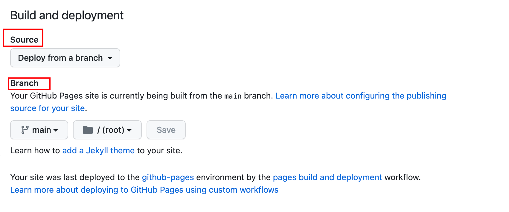
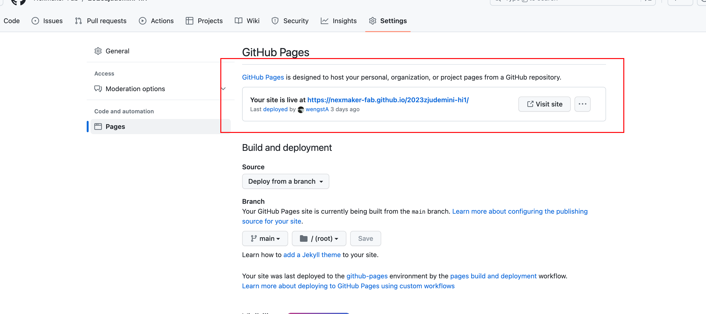
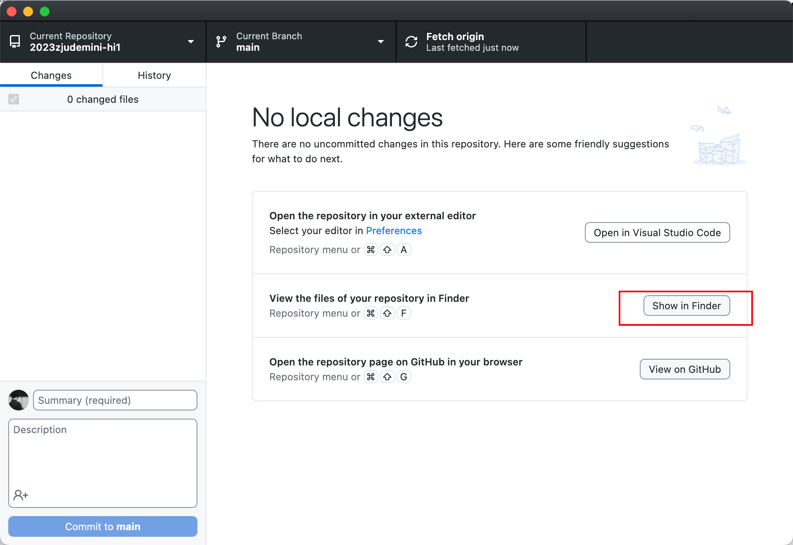
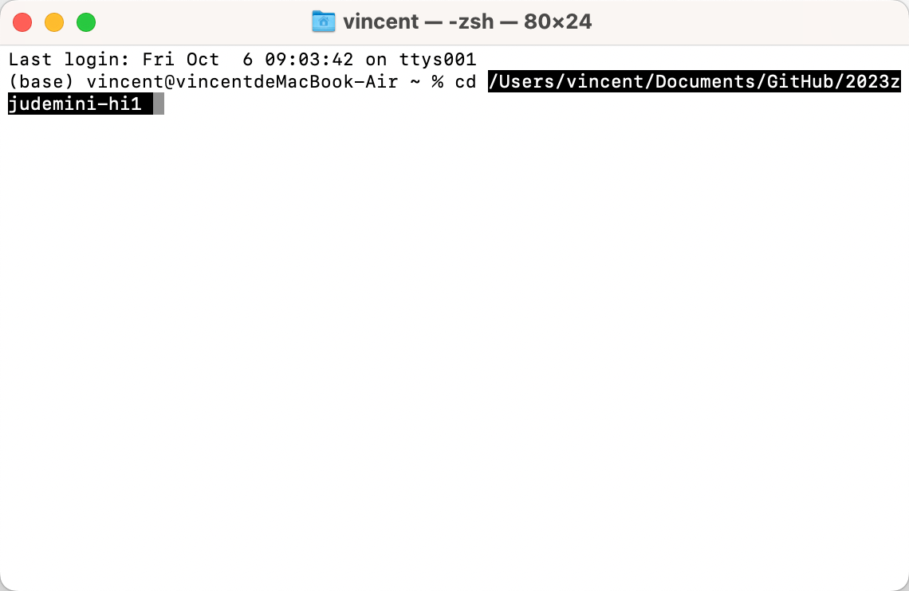
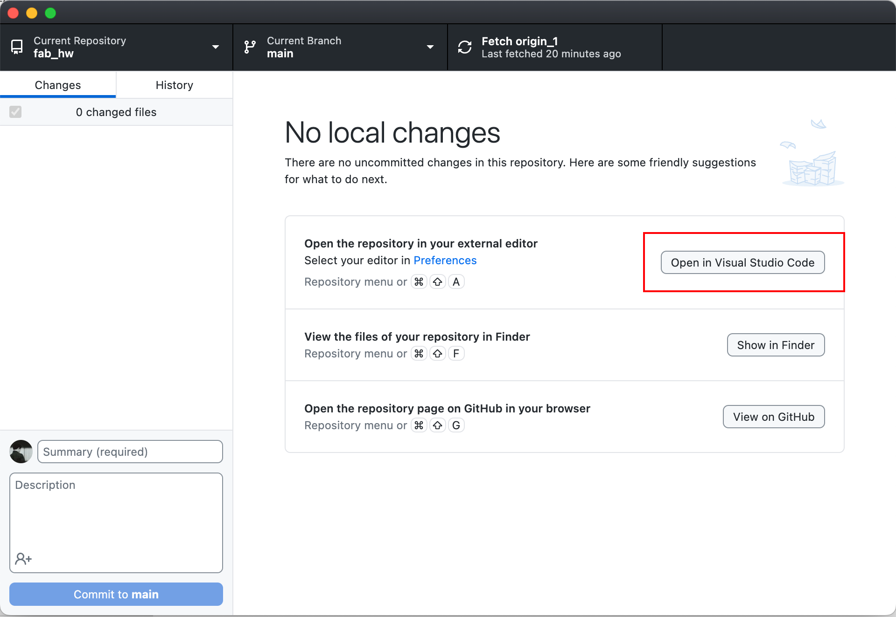
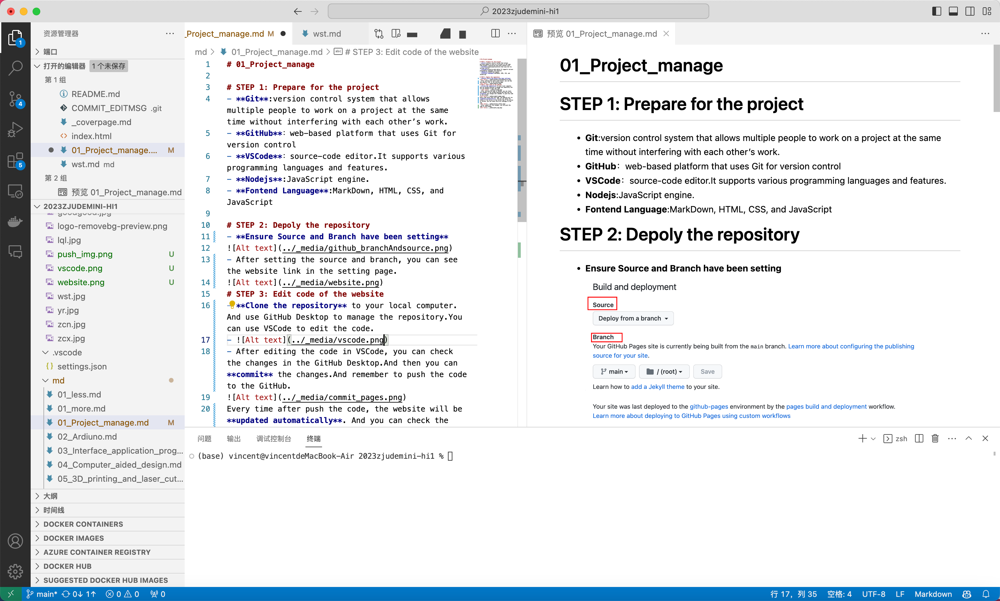
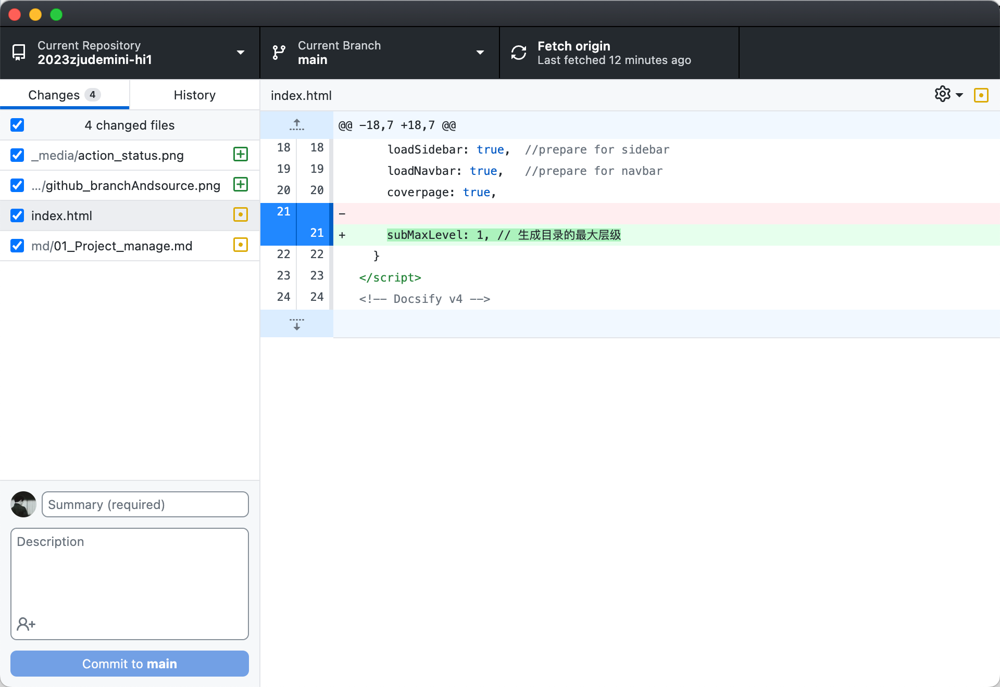
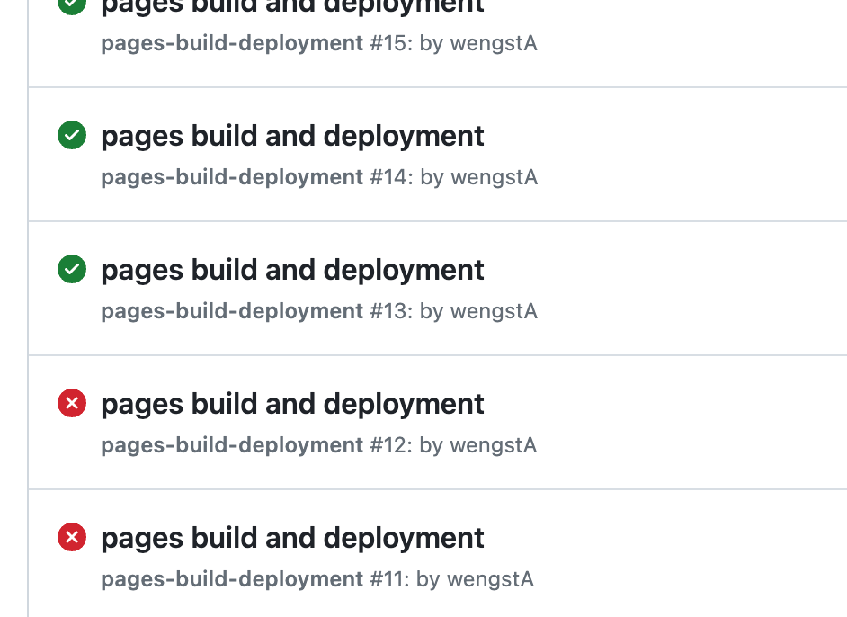
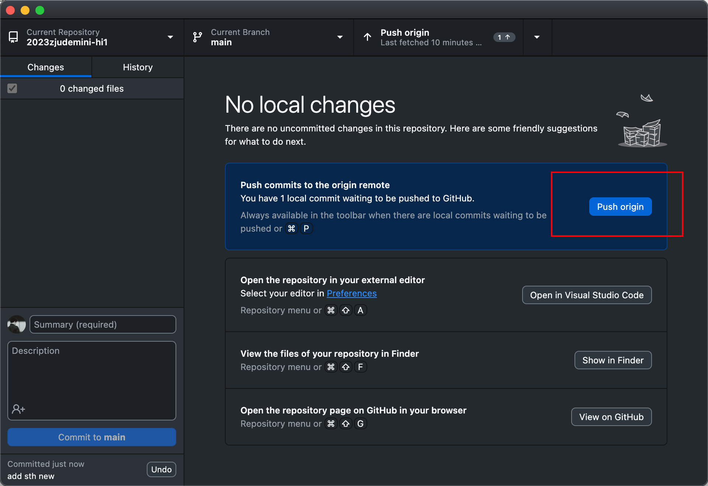

<style>
    .custom-title {
        font-family: "Arial", sans-serif;
        font-size: 2.5em;
        text-align: center;
        padding: 10px 0;
        color: #EFEFEF;
        border-bottom: 3px solid #FF6347;
        margin-bottom: 20px;
    }
</style>

<div class="custom-title">Project Manage</div>

# STEP 1: Prepare for the project
- **Git**:version control system that allows multiple people to work on a project at the same time without interfering with each other’s work. 
- **GitHub**：web-based platform that uses Git for version control
- **VSCode**：source-code editor.It supports various programming languages and features.
- **Nodejs**:JavaScript engine.
- **Fontend Language**:MarkDown, HTML, CSS, and JavaScript

# STEP 2: Depoly the repository
- **Ensure Source and Branch have been setting**

- After setting the source and branch, you can see the website link in the setting page. 


# STEP 3: Initial the repository
- **Clone the repository** to your local computer.And use GitHub Desktop to manage the repository.
- open the file folder of the repository in the terminal.  
  
- open the terminal in the file folder.
  
  - use command to initial the repository.
  ```bash
    npm i docsify-cli -g
    docsify init ./docs
    ```
# STEP 4: Edit code of the website
- You can use VSCode to edit the code.
- 
- You can also **preview** the markdown file in VSCode.

- After editing the code in VSCode, you can check the changes in the GitHub Desktop.And then you can **commit** the changes.And remember to push the code to the GitHub.

Every time after push the code, the website will be **updated automatically**. And you can check the status of the action in the action tap.If the action is failed, you can check the error message in the log.

- After commit all the changes, you can push the code to the GitHub.


# Dtails of the code
## Set the sidebar and navigation bar
- You can set the sidebar in the _sidebar.md file.
  ```markdown
  * [title](filepath)
  ```
- set the navigation bar in the _navbar.md file.
  ```markdown
  * [title](filepath)
  ```
## Set the cover page
- add coverpage: true in the index.html file.
  ```html
  <script>
    window.$docsify = {
      coverpage: true,
    }
  </script>
  ```
-  edit the cover page in the[ _coverpage.md](https://github.com/NexMaker-Fab/2023zjudemini-hi1/blob/main/_coverpage.md) file.

## Set the personal Introduce page with html
```html
<p align="center">
  
</p>

<h1 align="center">name</h1>

<p align="center">
self introduction
</p>
```
## Add Video in the website
```html
<iframe src=[url] width="640" height="480" frameborder="0" scrolling="no"></iframe>
```

