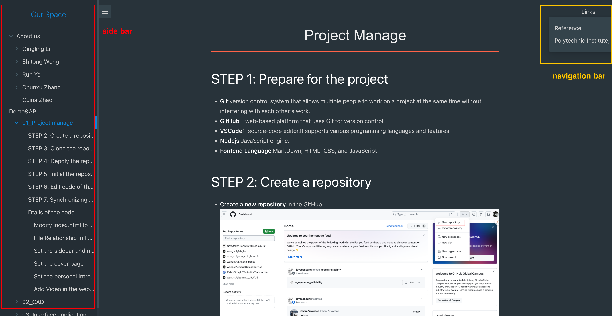
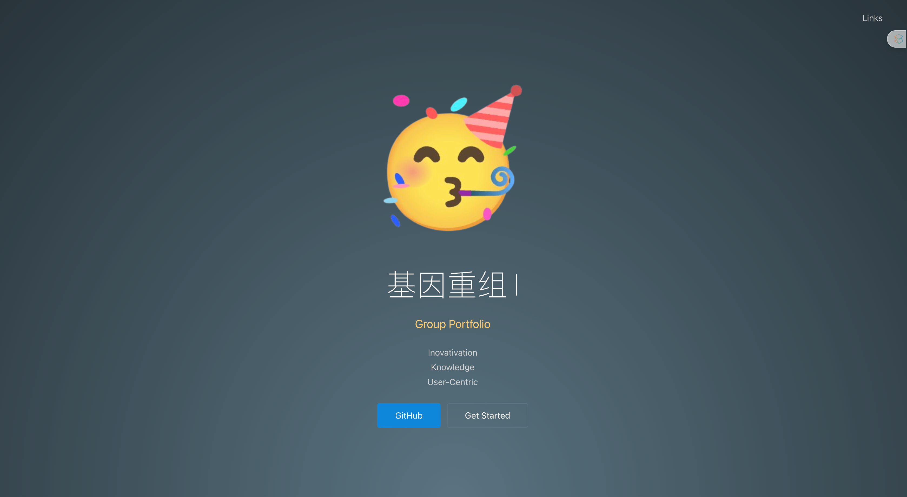
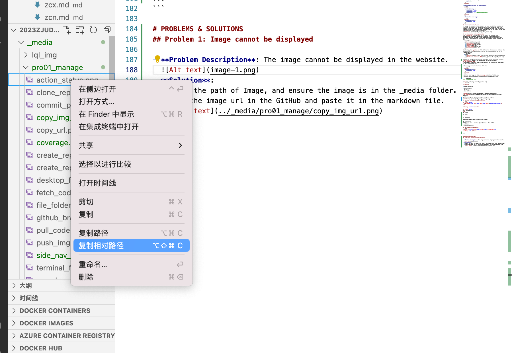
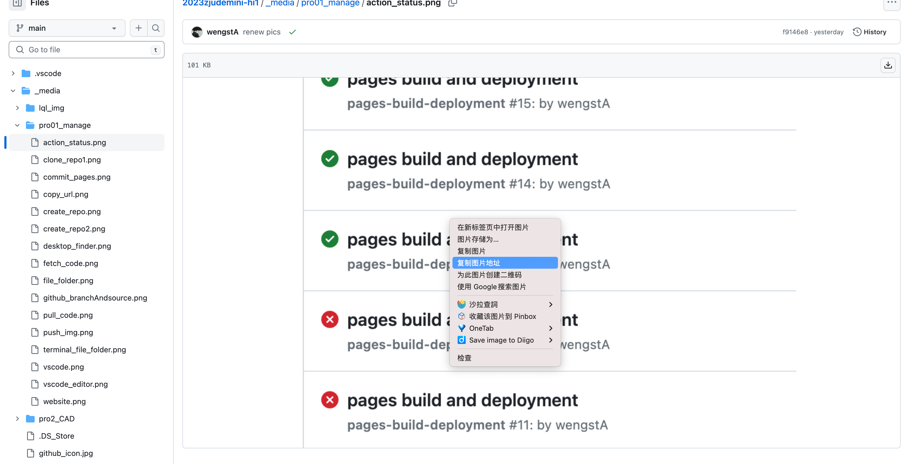
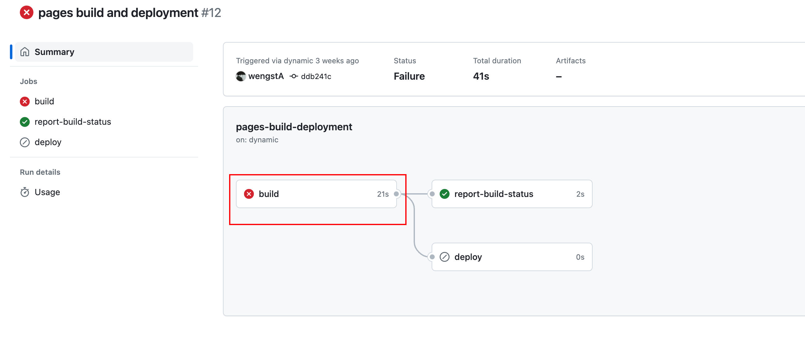
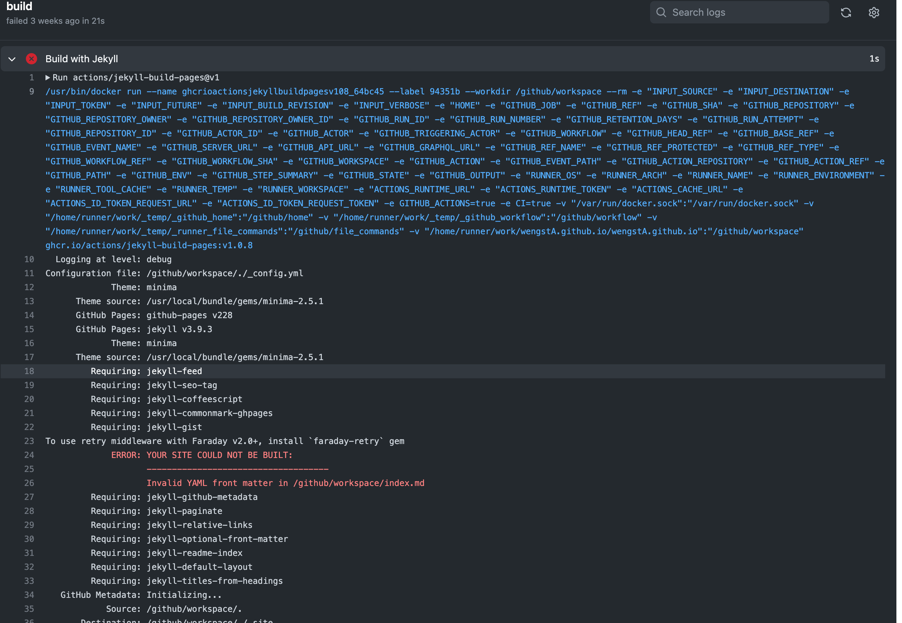

<style>
    .custom-title {
        font-family: "Arial", sans-serif;
        font-size: 2.5em;
        text-align: center;
        padding: 10px 0;
        color: #EFEFEF;
        border-bottom: 3px solid #FF6347;
        margin-bottom: 20px;
    }
</style>

<div class="custom-title">Project Manage</div>

# STEP 1: Prepare for the project
- **Git**:version control system that allows multiple people to work on a project at the same time without interfering with each other’s work. 
- **GitHub**：web-based platform that uses Git for version control
- **VSCode**：source-code editor.It supports various programming languages and features.
- **Nodejs**:JavaScript engine.
- **Fontend Language**:MarkDown, HTML, CSS, and JavaScript

# STEP 2: Create a repository
- **Create a new repository** in the GitHub.


# STEP 3: Clone the repository to the local computer

- **Clone the repository** to your local computer.And use GitHub Desktop to manage the repository.


# STEP 4: Depoly the repository
- **Ensure Source and Branch have been setting**

- After setting the source and branch, you can see the website link in the setting page. 


# STEP 5: Initial the repository
- **Clone the repository** to your local computer.And use GitHub Desktop to manage the repository.
- open the file folder of the repository in the terminal.  
  
- open the terminal in the file folder.
  
  - use command to initial the repository.
  ```bash
    npm i docsify-cli -g
    docsify init ./docs
    ```
# STEP 6: Edit code of the website
- You can use VSCode to edit the code.
- 
- You can also **preview** the markdown file in VSCode.


# STEP 7: Synchronizing code to GitHub
- After editing the code in VSCode, you can check the changes in the GitHub Desktop.And then you can **commit** the changes. *In Git, the commit process records changes to the repository by capturing a snapshot of the current state of the working directory.*


- Before pushing the code to the GitHub, you need to **fetch** and **pull** the code from the GitHub. It is aim to ensure that the code in the local computer is the latest version.


- Last, **push** the code to the GitHub.


Every time after push the code, the website will be **updated automatically**. And you can check the status of the action in the action tap.If the action is failed, you can check the error message in the log.


# Dtails of the code
## Modify index.html to enable some functions
- **Enable the search function**
  ```html
  <script>
    window.$docsify = {
      search: 'auto',
      placeholder: 'Search',
      noData: 'No Results!',
      depth: 3,
    }
  </script>
  ```
- **Enable Navigational Bar and Sidebar**
  ```html
  <script>
    window.$docsify = {
      loadSidebar: true,
      loadNavbar: true,
      subMaxLevel: 3, // 生成目录的最大层级
    }
  </script>
  ```
- **Enable the cover page**
  ```html
  <script>
    window.$docsify = {
      coverpage: true,
    }
  ```
## File Relationship In Fold
To manage the content of the sidebar, you need to edit the _sidebar.md file. And you can set the navigation bar in the _navbar.md file. The content of the cover page is in the _coverpage.md file. They are all in the root folder of the repository. And the files in the _media folder are the images and videos used in the website.


## Set the sidebar and navigation bar
The `_sidebar.md` file defines the structure and links of the documentation's sidebar navigation, enabling organized access to different sections or pages. Links are structured hierarchically with main topics and sub-topics. You can set the sidebar in the _sidebar.md file.
  ```markdown
  * [About us](md/about_us.md)
    * [Qingling Li](md/lql.md)
    * [Shitong Weng](md/wst.md)
    * [Run Ye](md/yr.md)
    * [Chunxu Zhang](md/zcx.md)
    * [Cuina Zhao](md/zcn.md)
  ```
Similarity , the `_navbar.md` file defines the structure and links of the documentation's navigation bar. You can set the navigation bar in the _navbar.md file.
  ```markdown
  * Links
    * [Reference](https://blog.csdn.net/Mark_md/article/details/121457115)
    * [Polytechnic Institute, ZJU](https://pi.zju.edu.cn/_s991/main.psp)
  ```
Sidebar and navigation bar will be displayed in the website as follows.

## Set the cover page
Cover page is the first page of the website. You can set the cover page in the _coverpage.md file.

add coverpage: true in the index.html file.
  ```html
  <script>
    window.$docsify = {
      coverpage: true,
    }
  </script>
  ```
 edit the cover page in the[ _coverpage.md](https://github.com/NexMaker-Fab/2023zjudemini-hi1/blob/main/_coverpage.md) file.

   ```markdown
<!-- _coverpage.md -->


# 基因重组 

> Group Portfolio

- Inovativation
- Knowledge
- User-Centric

[GitHub](https://github.com/NexMaker-Fab/2023zjudemini-hi1)
[Get Started](https://nexmaker-fab.github.io/2023zjudemini-hi1/#/md/about_us)
  ```
Cover page will be displayed in the website as follows.

## Personal Introduction page template
```html
<p align="center">
  
</p>

<h1 align="center">name</h1>

<p align="center">
self introduction
</p>
## Field

## Skills

## Education

### School Name (Year Started - Year Ended)

## Experiences
### Company Name / Position (Year Started - Year Ended)
- **Role**: 
- **Achievements**: 
```
## Add Video in the website
```html
<iframe src=[url] width="640" height="480" frameborder="0" scrolling="no"></iframe>

...
```

# PROBLEMS & SOLUTIONS
## Problem 1: Image cannot be displayed

- **Problem Description**: The image cannot be displayed in the website.
  
- **Solution**: 
  **1.  **Check the path of Image, and ensure the image is in the _media folder.U can use the relative path to set the image, which can be copied from the VSCode.
  
  **2.  **Copy the image url in the GitHub and paste it in the markdown file.
    
  
  ## Problem 2: The website cannot be updated automatically
  - **Problem Description**: The website cannot be updated automatically after pushing the code to the GitHub. In the action tap, the status of the action is failed.
  - **Solution**:
  Click Build error to see the error message in the log.
  - 
  - 


