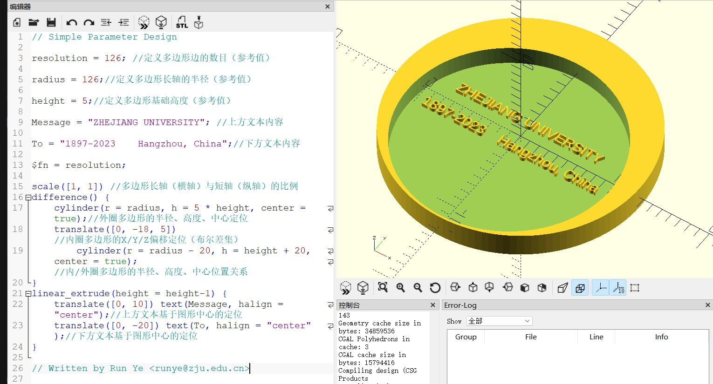

<style>
    .custom-title {
        font-family: "Arial", sans-serif;
        font-size: 2.5em;
        text-align: center;
        padding: 10px 0;
        color: #EFEFEF;
        border-bottom: 3px solid #FF6347;
        margin-bottom: 20px;
    }
</style>

<div class="custom-title">Computer Aided Design</div>


# 1. Introduction
Fusion 360 is a cloud-based 3D modelling, CAD, CAM, CAE and PCB software platform for product design and manufacturing.

- Design and engineer products how you want to ensure aesthetics, form, fit and function

- Engineer, design and create anything with comprsehensive electronics and PCB design tools

- Save time and money and get quality parts out the door faster


# 2. Modeling Showcase
<iframe src="https://myhub.autodesk360.com/ue28cacf9/shares/public/SH512d4QTec90decfa6e0c8b0367f72629bd?mode=embed" width="800" height="600" allowfullscreen="true" webkitallowfullscreen="true" mozallowfullscreen="true"  frameborder="0"></iframe>
<iframe src="https://myhub.autodesk360.com/ue28cacf9/shares/public/SH512d4QTec90decfa6e1571c0510c56f181?mode=embed" width="800" height="600" allowfullscreen="true" webkitallowfullscreen="true" mozallowfullscreen="true"  frameborder="0"></iframe>

# 3. First Sketch

# 4. Modeling Procedure


# 5. The plugin of the Fusion 360
**BOLT** is a plug-in in Fusion 360 that can construct bolts inside the model by customizing parameters.

**How To use:**
- 1.Click the plugin button and choose the SpurGear as the plugin.
- 2.Adjust the parameter of the plugin to make a gear.
- 3.Adjust the parameter of the plugin to make a gear.
- 4.The result of the gear made by plugin.
- 5.Then, you can use the gear made by plugin for another use.


In this example, bolted connections inside the device are constructed through BOLT inserts.
# 6. Motion Animation Procedure


# 7. Joint

*Powered by PTC. 

# 8. Simple Parameter Design


```openscad
// Simple Parameter Design

resolution = 126; //定义多边形边的数目（参考值）

radius = 126;//定义多边形长轴的半径（参考值）

height = 5;//定义多边形基础高度（参考值）

Message = "ZHEJIANG UNIVERSITY"; //上方文本内容

To = "1897-2023    Hangzhou, China";//下方文本内容

$fn = resolution;

scale([1, 1]) //多边形长轴（横轴）与短轴（纵轴）的比例
difference() {
    cylinder(r = radius, h = 5 * height, center = true);//外圈多边形的半径、高度、中心定位
    translate([0, -18, 5])//内圈多边形的X/Y/Z偏移定位（布尔差集）
        cylinder(r = radius - 20, h = height + 20, center = true);//内/外圈多边形的半径、高度、中心位置关系
}
linear_extrude(height = height-1) {
    translate([0, 10]) text(Message, halign = "center");//上方文本基于图形中心的定位
    translate([0, -20]) text(To, halign = "center");//下方文本基于图形中心的定位
}

// Written by Run Ye <runye@zju.edu.cn>
```
# 9. Mechanical Drawing
1. Generate mechanical drawing through model.
2. Determine views according to the subject.
3. Callout parameter.


*Powered by PTC

# 10. Other CAD Software
## Creo Parametric：
PTC’s developers created Creo Parametric as a sound foundation software that allows users the ability to expand deeper functionality with each component. As your products become more complex in its engineering, Creo offers expanded capabilities to meet your requirements. Every product isn’t made equal and your 3D CAD solution shouldn’t be either.
Creo Parametric provides the broadest range of powerful yet flexible CAD 3D modeling software capabilities to accelerate the design of parts and assemblies. With Creo and its extensions, you’ll have access to technologies such as:
-  Generative design
-  Real-time simulation
- Additive manufacturing
-  Augmented reality
<p align="left">
  <a href="https://www.ptc.com/en/products/creo/parametric" target="_blank"></a>
  &nbsp;
</p>


## SolidWorks
SolidWorks is a solid modeling computer-aided design (CAD) and computer-aided engineering (CAE) computer program that runs on Microsoft Windows. SolidWorks is published by Dassault Systèmes.
Like that, Solidworks is also knownas "DSS Solidworks". DSS means the Dassault Systems, the developer of this CAD software. This is CADsoftware, which helps to create 2D or 3D solid models without any complexity,  and in the costeffective way. The main advantage of the solid modeler is that very easy to use, simple graphics userinterface and much more friendly, as compared with other CAD solid modeling softwares such as Creo PTECatia etc. lt contains Solid part modeling, Assembly, Motion, Simulation, Toolbox, ToolAnalyst, CircuteWorks, PhotoView 360 ScanTo3D, e-drawings and DWG editor.
<p align="left">
  <a href="https://www.solidworks.com/" target="_blank"></a>
  &nbsp;
</p>

