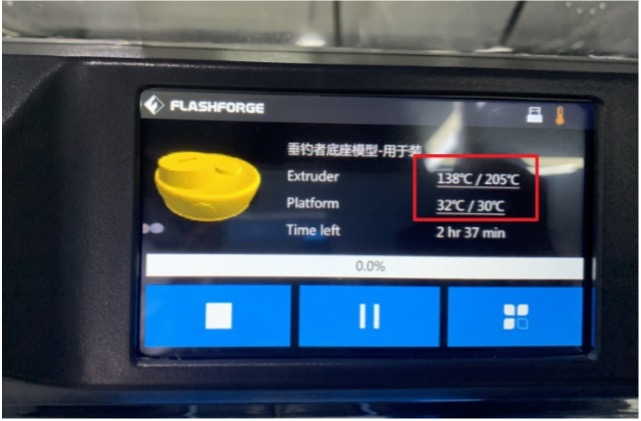
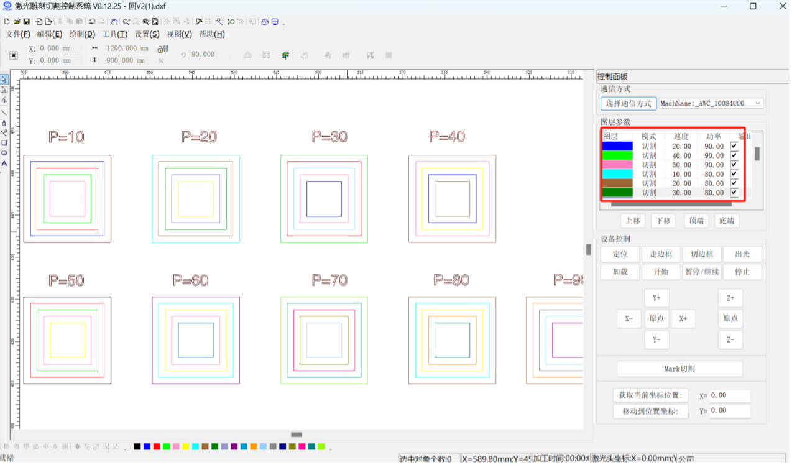

3D Printing And Laser Cutter

# Introduction
**3D printing (3DP)** is a type of rapid prototyping technology, also known as additive manufacturing , which is a technology based on a digital model file, the use of powdered metal or plastic and other bondable materials, by printing layer by layer to construct objects.

3D printing is usually realized using digital technology material printers. It is often used to make models in the fields of mold making and industrial design, and is gradually used in the direct manufacturing of some products, and there are already parts printed using this technology. The technology has applications in jewelry, footwear, industrial design, architecture, engineering and construction (AEC), automotive, aerospace, dental and medical industries, education, geographic information systems, civil engineering, firearms, and other fields.

# 3D Printer Test
## Test model Print with two different parameters
### **First Printing**
- **Parameters Setting**
  
    | model/Parameters     | nozzle temperature | platform temperature | fill density | base plate |
    |----------------------|--------------------|----------------------|--------------|------------|
    | model 1              | 200℃              | 30℃                 | 15%         | enabled    |
    | **model 2**             | **220℃**              | **50℃**                 | **30**%         | **Disable**    |

(nozzle temperature 200°; platform temperature30℃；fill density 15%; base plate enabled)

 
 
 
- **Printing process**
 

### Second printing
- **Parameters**
  

    | model/Parameters     | nozzle temperature | platform temperature | fill density | base plate |
    |----------------------|--------------------|----------------------|--------------|------------|
    | **model 1**              | **200℃**              | **30℃**                 | **15%**         | **enabled**    |
    | model 2              | 220℃              | 50℃                 | 30%         | Disable    |

 
- **Printing process**
 
  
### Comparison of results between two printouts
1. **First Time** (nozzle temperature 210°; fill density 15%; base plate enabled) 
   
2. **Second Time**(nozzle temperature 200°; filling density 20%; base plate not activated) 
   
**Result:** Better quality on the second print

### Test model printing and assemble it
1.	The process of printing.  

2.	Remove the supporting structure of the printed model.  

3.	Assemble the parts.  

5.	The result of the 3D print model.  

# Laser Cutting
## Power and Speed Test
1.	The software sets the power and speed of the test pattern hierarchically.
 
2.	Cutting test with machine.
 
3.	Two results of the laser cutting.

 
4.	Statistics on cutting test results.

| Speed/Power | 10 | 20 | 30 | 40 | 50 | 60 | 70 |
|----------|----|----|----|----|----|----|----|
| 10       | ×  | √ | √  | √  | √  | √  | √  |
| 20       | ×  | ×  | √  | √  | √  | √  | √  |
| 30       | ×  | ×  | √  | √  | √  | √  | √  |
| 40       | ×  | ×  | ×  | √  | √  | √  | √  |
| 50       | ×  | ×  | ×  | ×  | ×  | √  | √  |

## Cutting Accuracy Test
1.	Import cutting target image to the machine.
 
2.	Collect the finished materials from the cutter.
 
3.	Measure the actual length to see the error. The width of a single part is 5mm, the number is 10, the total statistical length is 46.75mm, and the error is 3.25mm. Therefore, the value of Kurf is 3.25/10=0.325mm.
 

## Laser Cutting Practice
### 1.	Draw the shape with Adobe Illustrator.
 

 ### 2.	Import the file into Laser CAD V8.12

### 3.	Set different parameters (power/speed) with different colors in Laser CAD V8.12

### 4.	Open the Laser cutting machine to location and border running

### 5.	Begin to laser cutting

### 6.	The result of laser cutting
