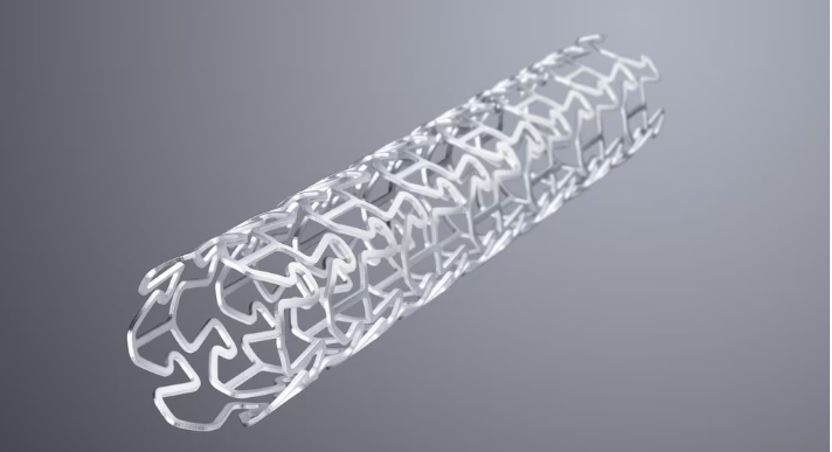

3D Printing And Laser Cutter

# Introduction
**3D printing (3DP)** is a type of rapid prototyping technology, also known as additive manufacturing , which is a technology based on a digital model file, the use of powdered metal or plastic and other bondable materials, by printing layer by layer to construct objects.

3D printing is usually realized using digital technology material printers. It is often used to make models in the fields of mold making and industrial design, and is gradually used in the direct manufacturing of some products, and there are already parts printed using this technology. The technology has applications in jewelry, footwear, industrial design, architecture, engineering and construction (AEC), automotive, aerospace, dental and medical industries, education, geographic information systems, civil engineering, firearms, and other fields.

# Cutting-edge research on 3D printing 
## 1.	3D printing with AI
The rapid development of 3D printing is inseparable from the continuous improvement of a series of complementary technologies, which complement each other and achieve each other. The convergence of AM technology with artificial intelligence (AI) and robotics means that cutting-edge printing and automation technologies can work together to drive productivity to new heights. With the continuous development of 3D printing technology, it is becoming more and more difficult and cheaper for people to use it. Smaller companies with more agile business models are likely to adopt the technology quickly, challenging industry leaders with innovations. At the same time, cutting-edge companies will increasingly use additive manufacturing to gain a competitive advantage by integrating 3D printing with automation and robotics.
Companies will continue to use new computing and software tools to unlock the limitless potential of additive manufacturing. This is helping to generate new materials and push 4D printing forward - using 3D printing technology to print objects while adding a time dimension or energy source so that their shape or properties change over time.
The medical industry is an early adopter of 3D printing technology, using it to produce prosthetics, implants, and orthopaedic products tailored to individual patients. The medical 3D printing market (including materials, services, software, and hardware) is currently valued at $1.25 billion, and this figure is expected to grow to $6.08 billion by 2027.

## 2. 3D printing in the medical industry
"Medical device companies like Stryker are using AM to produce implantable devices, such as artificial knee, hip, and spinal implants, which are typically made of titanium." Kristin Mulherin said, "In order to effectively solve the problem of osseointegration, they developed a proprietary algorithm that allows the metal device to fit into the patient's bone. A 3D printer can create a strong and lightweight implant with a finely processed surface that binds firmly to bone tissue."
Later, 3D printers that can print color functional parts appeared on the market, which also opened up new possibilities and applications for this technology. Over the past few years, surgeons have become accustomed to using 3D technology to create complex anatomical models of organs to help them prepare for surgery. Because additive manufacturing supports color printing, doctors can easily distinguish between veins and arteries. They sometimes print out a 3D model of an individual patient's heart and use it to rehearsed the procedure and find the ideal surgical plan.

# 3D Printer Test
## Test model Print with two different parameters
### **First Printing**
- **Parameters Setting**
  
    | model/Parameters     | nozzle temperature | platform temperature | fill density | base plate |
    |----------------------|--------------------|----------------------|--------------|------------|
    | model 1              | 205℃              | 30℃                 | 15%         | enabled    |
    | **model 2**             | **220℃**              | **50℃**                 | **30**%         | **Disable**    |

(nozzle temperature 200°; platform temperature30℃；fill density 15%; base plate enabled)

 <figure>
  
  <figcaption style="text-align:center;"> Slicing software import interface</figcaption>
</figure>

 <figure>
  
  <figcaption style="text-align:center;"> Slice Import Preview</figcaption>
</figure>

<figure>
  
  <figcaption style="text-align:center;"> Slice Preview 1</figcaption>
</figure>

<figure>
  
  <figcaption style="text-align:center;"> Slice Preview 2</figcaption>
</figure>

- **Printing process**
 

### Second printing
- **Parameters**
  

    | model/Parameters     | nozzle temperature | platform temperature | fill density | base plate |
    |----------------------|--------------------|----------------------|--------------|------------|
    | **model 1**              | **200℃**              | **30℃**                 | **15%**         | **enabled**    |
    | model 2              | 220℃              | 50℃                 | 30%         | Disable    |

<figure>
  
  <figcaption style="text-align:center;"> See the Slice Import Preview gif above for a detailed view of the interface</figcaption>
</figure>

- **Printing process**
 
  
### Comparison of results between two printouts

1.	Parameters Comparison

| model/Parameters     | nozzle temperature | platform temperature | fill density | base plate |
|----------------------|--------------------|----------------------|--------------|------------|
| model 1              | 205℃              | 30℃                 | 15%         | enabled    |
| model 2             | 220℃              | 50℃                 | 30%         | Disable    |

2. 3D Printing result Comparison
    ①nozzle/ platform temperature comparison
    <table align="center"><tr>
    <td></td>
    <td></td>
    </tr></table>
    ②fill density comparison
    <table align="center"><tr>
    <td></td>
    <td></td>
    </tr></table>
    ③base plate comparison
    <table align="center"><tr>
    <td></td>
    <td></td>
    </tr></table>
**Result:** Better quality on the second print

### Test model printing and assemble it
1.	The process of printing.  

2.	Remove the supporting structure of the printed model.  

3.	Assemble the parts.  

5.	The result of the 3D print model.  

# Laser Cutting
## Advantages of laser cutting
### 1.	Material range
All materials common in industrial processing – from steel to aluminum, stainless steel, and non-ferrous metal sheets, all the way to non-metal materials such as plastics, glass, wood, or ceramics – can be cut safely and in high quality with the laser. Very different sheet thicknesses of 0.5 to over 30 millimeters can be cut using the tool. This extremely wide material range makes the laser the top cutting tool for many applications in the area of metals and non-metals.

### 2.	Contour freedom
The bundled laser beam only heats up the material locally, and the rest of the workpiece is subjected to minimal thermal stresses or not at all. This means the kerf is barely wider than the beam and even complex, intricate contours may be cut smoothly and free of burrs. Time-consuming post-processing is no longer necessary in most cases. Due to its flexibility, this cutting procedure is often used for small lot sizes, large variant ranges, and in prototype construction.
 <figure>
  
  <figcaption style="text-align:center;">Discover the variety of different cutting procedures</figcaption>
</figure>

## Cutting-edge research on laser cutting
### 1. Flame cutting
In flame cutting, oxygen is used as the cutting gas. The oxygen is blown into the kerf at pressures of up to 6 bar. There, the heated metal reacts with the oxygen: it begins to burn and oxidizes. The chemical reaction releases large amounts of energy - up to five times the laser energy - and assists the laser beam. Flame cutting makes it possible to cut at high speeds and handle jobs involving thick plates such as mild steel with thicknesses in excess of 30 millimeters.

### 2. Fusion cutting
Nitrogen or argon is used as the cutting gas here. The gas is blown through the kerf at pressures ranging from 2 to 20 bar. Argon and nitrogen are inert gases.
This means that they do not react with the molten metal in the kerf. They simply blow it out toward the bottom. Simultaneously, they shield the cut edge from the air.
The great advantage of fusion cutting: cut edges are oxide free and do not require further treatment. Nevertheless, the laser beam must supply all of the energy needed for cutting. For this reason, cutting speeds as high as those in flame cutting can be achieved only in thin sheets.
Piercing is also more difficult. Some cutting systems allow you to use oxygen to pierce the material and then switch over to nitrogen for cutting.

### 3. Sublimation cutting
This process is rarely used in sheet metal fabrication. Its use, however, becomes attractive in applications involving particularly delicate cutting work. Such applications include the production of stents.
In metal processing, sublimation cutting is the exception;
with nonmetals, it is very common. Many non-metal materials are regularly processed with sublimation cutting. Typical materials include:
• Plastic sheeting and textiles, which vaporize even when only a small amount of energy is applied
• Materials that do not melt, such as wood,
cardboard, or foam

</figure>

## Power and Speed Test
1.	The software sets the power and speed of the test pattern hierarchically.
 
2.	Cutting test with machine.
 
3.	Two results of the laser cutting.

 4.	Statistics on cutting test results.

| Speed/Power | 10 | 20 | 30 | 40 | 50 | 60 | 70 |
|----------|----|----|----|----|----|----|----|
| 10       | ×  | √ | √  | √  | √  | √  | √  |
| 20       | ×  | ×  | √  | √  | √  | √  | √  |
| 30       | ×  | ×  | √  | √  | √  | √  | √  |
| 40       | ×  | ×  | ×  | √  | √  | √  | √  |
| 50       | ×  | ×  | ×  | ×  | ×  | √  | √  |

## Cutting Accuracy Test
1.	Import cutting target image to the machine.
 
2.	Collect the finished materials from the cutter.
 
3.	Measure the actual length to see the error. The width of a single part is 5mm, the number is 10, the total statistical length is 46.75mm, and the error is 3.25mm. Therefore, the value of Kurf is 3.25/10=0.325mm.
 

## Laser Cutting Practice
### 0. Preparation

<figure>
  
  <figcaption style="text-align:center;"> Turn on the master switch</figcaption>
</figure>
<figure>
  
  <figcaption style="text-align:center;"> Turn on the master switch</figcaption>
</figure>
<figure>
  
  <figcaption style="text-align:center;"> Turn on the laser</figcaption>
</figure>
<figure>
  
  <figcaption style="text-align:center;"> Access computer</figcaption>
</figure>

<figure>
  
   
    
    
    
  <figcaption style="text-align:center;"> Transport Data</figcaption>
</figure>

<figure>
  
  <figcaption style="text-align:center;"> Open the lid</figcaption>
</figure>
<figure>
  
  <figcaption style="text-align:center;">Moving Laser Position</figcaption>
</figure>
<figure>
  
  <figcaption style="text-align:center;"> Mobile platforms for positioning 1</figcaption>
</figure>
<figure>
  
  <figcaption style="text-align:center;"> Mobile platforms for positioning 2</figcaption>
</figure>

### 1.	Draw the shape with Adobe Illustrator.
 

 ### 2.	Import the file into Laser CAD V8.12

### 3.	Set different parameters (power/speed) with different colors in Laser CAD V8.12

### 4.	Open the Laser cutting machine to location and border running

### 5.	Begin Laser Cutting

### 6.	The result of laser cutting
