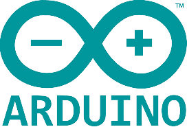
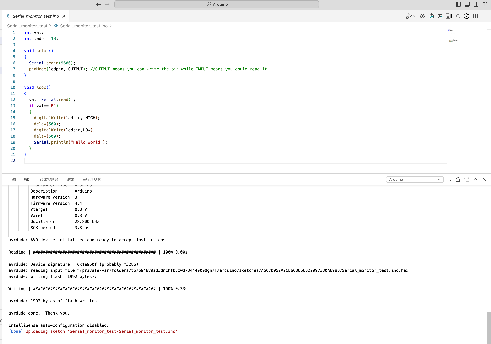

<style>
    .custom-title {
        font-family: "Arial", sans-serif;
        font-size: 2.5em;
        text-align: center;
        padding: 10px 0;
        color: #EFEFEF;
        border-bottom: 3px solid #FF6347;
        margin-bottom: 20px;
    }
     h1 {
            font-size: 2em;
            display: flex;
            align-items: center;
        }

        .heading-icon {
            margin-right: 0.5em; /* Adds some space between the icon and the text */
            width: 32px; /* You can adjust this based on the desired size of your icon */
            height: 32px;
        }
        .heading-icon2 {
            margin-right: 0.5em; /* Adds some space between the icon and the text */
            width: 32px; /* You can adjust this based on the desired size of your icon */
            height: 24px;
        }
</style>

<div class="custom-title">Arduino</div>

<h1>
        
        Open Source
    </h1>

## What is Open Source？
The term open source refers to something people can modify and share because its design is publicly accessible.

## What is open source software?
Open source software is software with source code that anyone can inspect, modify, and enhance.

## Open Source Hardware
"Open hardware," or "open source hardware," refers to the design specifications of a physical object which are licensed in such a way that said object can be **studied, modified, created, and distributed by anyone**.<br>
"Open hardware" is **a** **set of design principles and legal practices, not a specific type of object.** The term can therefore refer to any number of objects—like automobiles, chairs, computers, robots, or even houses.<br>

Like open source software, the "source code" for open hardware—schematics, blueprints, logic designs, Computer Aided Design (CAD) drawings or files, etc.—i**s available for modification or enhancement by anyone under permissive licenses.** Users with access to the tools that can read and manipulate these source files can update and improve the code that underlies the physical device. They can add features or fix bugs in the software. They can even modify the physical design of the object itself and, if they wish, proceed to share such modifications.<br>
Open hardware's source code should be **readily accessible,** and its components are preferably easy for anyone to obtain. Essentially, open hardware eliminates common roadblocks to the design and manufacture of physical goods; it provides as many people as possible the ability to construct, remix, and share their knowledge of hardware design and function.

## What is License?
Open source licenses are licenses that allow software to be freely used, modified, and shared. These licenses are designed to ensure that software remains open and can be freely distributed and modified, while also providing contributors with protection and acknowledgment for their work.[license review process](https://opensource.org/licenses/review-process/).

1. **Permissive Licenses**: These are licenses that have minimal requirements on how the software can be modified or distributed.
    - **[MIT License](https://opensource.org/license/mit/)**: A short and simple permissive license with conditions only requiring preservation of copyright and license notices.
    - **[Apache License 2.0](https://www.apache.org/licenses/LICENSE-2.0)**: Permits almost any use of the software but also provides an express grant of patent rights from contributors to users.
    - **[BSD Licenses](https://opensource.org/license/bsd-3-clause/)**: There are different variations (e.g., 2-Clause, 3-Clause), but generally they are permissive licenses with conditions on how the software's origin must be acknowledged.
2. **Copyleft Licenses**: These licenses allow derivative works but require those works to be licensed under the same terms as the original. This ensures that modifications and improvements are also kept open source.
    - **[GNU General Public License (GPL)](https://www.gnu.org/licenses/gpl-3.0.html)**: There are different versions (e.g., GPLv2, GPLv3), but in general, GPL ensures that any derived works are also open source under the GPL. GPLv3 added provisions related to patents and tivoization.
    - **[GNU Lesser General Public License (LGPL)](https://www.gnu.org/licenses/lgpl-3.0.en.html)**: This is like the GPL, but with some exceptions that allow it to be used in proprietary software under specific conditions.
    - **[Mozilla Public License 2.0 (MPL 2.0)](https://www.gnu.org/licenses/lgpl-3.0.en.html)**: A file-level copyleft license, meaning only the files that are modified need to be shared under the same license.

### Know More about Liscence
1.  [What is the MIT License?](https://snyk.io/learn/what-is-mit-license/)
2.  [What is GNU General Public License (GNU GPL or GPL)?](https://www.techtarget.com/searchdatacenter/definition/GNU-General-Public-License-GNU-GPL-or-simply-GPL)
3.  [What is the BSD License? Top 10 questions answered](https://snyk.io/learn/what-is-bsd-license/)
4. [Apache License 2.0 Explained](https://snyk.io/learn/apache-license/)
5. [GNU General Public License: GPLv3 explained](https://snyk.io/learn/what-is-gpl-license-gplv3-explained/)
### Refernce
1. [What is open source?](https://opensource.com/resources/what-open-source)
2. [What is open hardware? ](https://opensource.com/resources/what-open-hardware)


---

<h1>
        
        Arduino
    </h1>

## What is Arduino?
Open-source electronic prototyping platform enabling users to create interactive electronic objects.

## How to develop Arduino?
1. **Arduino IDE**: Arduino IDE is a cross-platform application that is written in functions from C and C++. It is used to write and upload programs to Arduino compatible boards, but also, with the help of 3rd party cores, other vendor development boards.
2. **Edit on VSCode**: With Copilot and extension, VSCode could accelerate the development of Arduino.<br>
[Arduino CLI with Visual Studio Code on MacOS](https://medium.com/@thomas.kilmar/arduino-cli-with-visual-studio-code-on-macos-d2ad32ff0276)<br>
[Mac configure Arduino VSCode enviroment](https://blog.csdn.net/a71468293a/article/details/117151920)


### Run water light program
Produce a visual effect where LED1 (connected to pin 2) will light up first, then turn off, followed by LED2 (pin 3) lighting up and turning off, and then LED3 (pin 4) lighting up and turning off. This **sequence will repeat in a loop**, giving the appearance of a light "running" from LED1 to LED3.
```Arduino
int base=2;     // Starting pin number for the LED sequence
int count=3;    // Number of LEDs (or pins) involved in the sequence

void setup()
{
    // Initialize pins as OUTPUT for controlling LEDs
    for(int i=base; i<base+count; i++)
    {
        pinMode(i, OUTPUT);
    }
}

void loop()
{
    // Cycle through each LED
    for(int i=base; i<base+count; i++)
    {
        digitalWrite(i, HIGH);   // Turn ON the LED connected to pin 'i'
        delay(500);              // Wait for 0.5 seconds
        digitalWrite(i, LOW);    // Turn OFF the LED connected to pin 'i'
        delay(500);              // Wait for 0.5 seconds before moving to the next LED
    }
}

```

<video width="320" height="240" controls>
    <source src="../_media/pro4_Arduino/run_water_light.mp4" type="../_media/pro4_Arduino/run_water_light.mp4">
Your browser does not support the video tag.
</video>
