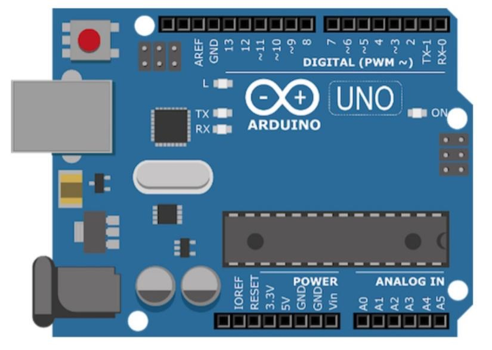
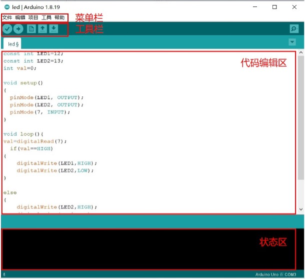
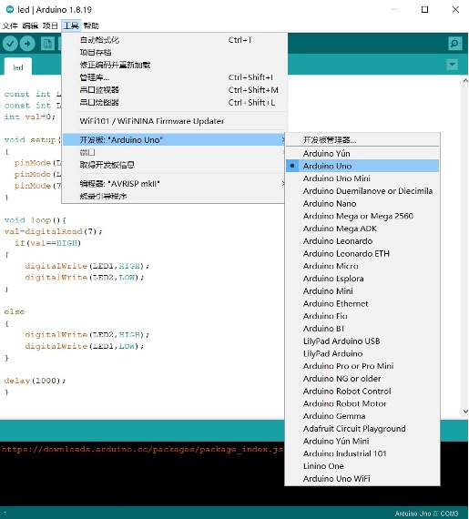
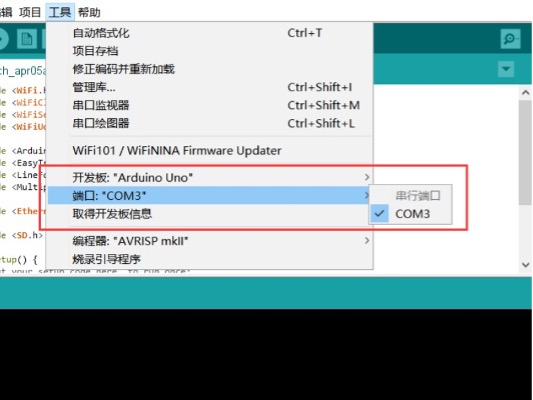
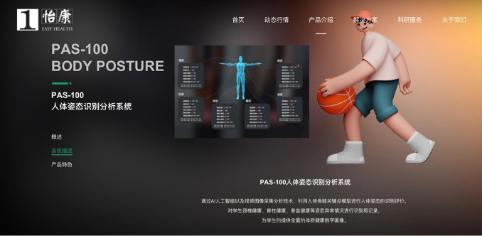
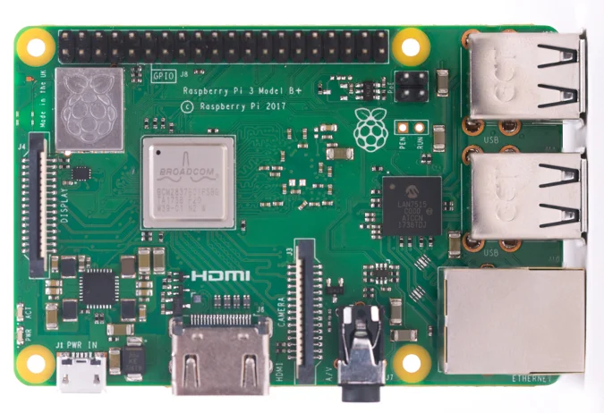

<style>
    .custom-title {
        font-family: "Arial", sans-serif;
        font-size: 2.5em;
        text-align: center;
        padding: 10px 0;
        color: #EFEFEF;
        border-bottom: 3px solid #FF6347;
        margin-bottom: 20px;
    }
     h1 {
            font-size: 2em;
            display: flex;
            align-items: center;
        }

        .heading-icon {
            margin-right: 0.5em; /* Adds some space between the icon and the text */
            width: 32px; /* You can adjust this based on the desired size of your icon */
            height: 32px;
        }
        .heading-icon2 {
            margin-right: 0.5em; /* Adds some space between the icon and the text */
            width: 32px; /* You can adjust this based on the desired size of your icon */
            height: 24px;
        }
    body {
            height: 100vh;
            display: flex;
            justify-content: center;
            align-items: center;
        }

        /* 设置iframe的大小 */
        iframe {
            width: 80%;  /* 设置为页面宽度的80% */
            height: 400px; 
        }
</style>

<div class="custom-title">Arduino</div>

<h1>
        
        Open Source
    </h1>

## What is Open Source？
The term open source refers to something people can modify and share because its design is publicly accessible.

## What is open source software?
Open source software is software with source code that anyone can inspect, modify, and enhance.

## Open Source Hardware
"Open hardware," or "open source hardware," refers to the design specifications of a physical object which are licensed in such a way that said object can be **studied, modified, created, and distributed by anyone**.<br>
"Open hardware" is **a** **set of design principles and legal practices, not a specific type of object.** The term can therefore refer to any number of objects—like automobiles, chairs, computers, robots, or even houses.<br>

Like open source software, the "source code" for open hardware—schematics, blueprints, logic designs, Computer Aided Design (CAD) drawings or files, etc.—i**s available for modification or enhancement by anyone under permissive licenses.** Users with access to the tools that can read and manipulate these source files can update and improve the code that underlies the physical device. They can add features or fix bugs in the software. They can even modify the physical design of the object itself and, if they wish, proceed to share such modifications.<br>
Open hardware's source code should be **readily accessible,** and its components are preferably easy for anyone to obtain. Essentially, open hardware eliminates common roadblocks to the design and manufacture of physical goods; it provides as many people as possible the ability to construct, remix, and share their knowledge of hardware design and function.

## What is License?
Open source licenses are licenses that allow software to be freely used, modified, and shared. These licenses are designed to ensure that software remains open and can be freely distributed and modified, while also providing contributors with protection and acknowledgment for their work.[license review process](https://opensource.org/licenses/review-process/).

1. **Permissive Licenses**: These are licenses that have minimal requirements on how the software can be modified or distributed.
    - **[MIT License](https://opensource.org/license/mit/)**: A short and simple permissive license with conditions only requiring preservation of copyright and license notices.
    - **[Apache License 2.0](https://www.apache.org/licenses/LICENSE-2.0)**: Permits almost any use of the software but also provides an express grant of patent rights from contributors to users.
    - **[BSD Licenses](https://opensource.org/license/bsd-3-clause/)**: There are different variations (e.g., 2-Clause, 3-Clause), but generally they are permissive licenses with conditions on how the software's origin must be acknowledged.
2. **Copyleft Licenses**: These licenses allow derivative works but require those works to be licensed under the same terms as the original. This ensures that modifications and improvements are also kept open source.
    - **[GNU General Public License (GPL)](https://www.gnu.org/licenses/gpl-3.0.html)**: There are different versions (e.g., GPLv2, GPLv3), but in general, GPL ensures that any derived works are also open source under the GPL. GPLv3 added provisions related to patents and tivoization.
    - **[GNU Lesser General Public License (LGPL)](https://www.gnu.org/licenses/lgpl-3.0.en.html)**: This is like the GPL, but with some exceptions that allow it to be used in proprietary software under specific conditions.
    - **[Mozilla Public License 2.0 (MPL 2.0)](https://www.gnu.org/licenses/lgpl-3.0.en.html)**: A file-level copyleft license, meaning only the files that are modified need to be shared under the same license.

### Know More about Liscence
1.  [What is the MIT License?](https://snyk.io/learn/what-is-mit-license/)
2.  [What is GNU General Public License (GNU GPL or GPL)?](https://www.techtarget.com/searchdatacenter/definition/GNU-General-Public-License-GNU-GPL-or-simply-GPL)
3.  [What is the BSD License? Top 10 questions answered](https://snyk.io/learn/what-is-bsd-license/)
4. [Apache License 2.0 Explained](https://snyk.io/learn/apache-license/)
5. [GNU General Public License: GPLv3 explained](https://snyk.io/learn/what-is-gpl-license-gplv3-explained/)
### Refernce
1. [What is open source?](https://opensource.com/resources/what-open-source)
2. [What is open hardware? ](https://opensource.com/resources/what-open-hardware)

### Our Focusing Open Source Project

**OpenPose** has represented the first real-time multi-person system to jointly detect human body, hand, facial, and foot keypoints (in total 135 keypoints) on single images.
[Open Pose](https://github.com/CMU-Perceptual-Computing-Lab/openpose)

#### Why we choose OpenPose?(Keypoint we need)
- 2D real-time multi-person keypoint detection
- 3D real-time single-person keypoint detection:
- Calibration toolbox
- Single-person tracking for further speedup or visual smoothing.<br>
  
We would do a project aiming to detect the keypoints of human body and correct the posture of human body. Openpose is a good choice for us to do this project.

---

<h1>
        
        Arduino
    </h1>

## What is Arduino?
Open-source electronic prototyping platform enabling users to create interactive electronic objects.

## How to develop Arduino?
### 1. **Arduino IDE**: 
Arduino IDE is a cross-platform application that is written in functions from C and C++. It is used to write and upload programs to Arduino compatible boards, but also, with the help of 3rd party cores, other vendor development boards.
   #### 1.1 Four Parts of Arduino IDE
   
   - **Menu bar,** containing File menu, Edit menu, Program menu, Tools menu and Help menu;
   - **Toolbar,** containing compile, upload, new program (sketch), open program (sketch), save program (sketch) and serial monitor (Serial Monitor);
   - **Edit area,** writing program code area;
   - **Status area,** display program compilation and upload information, if the program error will have error message.
  
#### 1.2 Configure Arduino IDE
Arduino uses the serial port to download the code and store it in the internal flash, that is, to burn the program into the Arduino, a total of three steps are needed
 - Select the **corresponding routine program**
 - Select the **corresponding board**
 - Configure the **download port** of the Arduino board.


  

### 2. **Edit on VSCode**: With Copilot and extension, VSCode could accelerate the development of Arduino.<br>
[Arduino CLI with Visual Studio Code on MacOS](https://medium.com/@thomas.kilmar/arduino-cli-with-visual-studio-code-on-macos-d2ad32ff0276)<br>
[Mac configure Arduino VSCode enviroment](https://blog.csdn.net/a71468293a/article/details/117151920)


### 3. Arduino Coding Method
Arduino programming uses a simplified version of the C++ language, and the development environment (IDE) provides a lot of built-in functions that abstract some of the complexities of microcontroller programming.

Here's a basic structure of an Arduino sketch (program):
```Arduino
// Global variable and library declarations
#include <LibraryName.h>  // Include any necessary libraries here

int someVariable = 0;

// Setup function: Runs once when the Arduino is powered on or reset
void setup() {
  pinMode(LED_BUILTIN, OUTPUT);  // Set the built-in LED as an output
  Serial.begin(9600);            // Initialize serial communication at 9600 bps
}

// Loop function: Runs repeatedly after the setup() function completes
void loop() {
  digitalWrite(LED_BUILTIN, HIGH);   // Turn on the LED
  delay(1000);                       // Wait for 1000 milliseconds (1 second)
  digitalWrite(LED_BUILTIN, LOW);    // Turn off the LED
  delay(1000);                       // Wait for another second
}

```
1. **Library Inclusion:** Libraries expand the functionality of the Arduino. For instance, there are libraries for displays, sensors, motors, etc. The #include directive lets you include them.
2. **Global Variables:** Variables declared outside of functions are global, and they can be accessed anywhere in the sketch.
3. **setup() function:** This is executed once when the Arduino starts up. It's typically used for initialization tasks, like setting pin modes or starting serial communication.
4. **loop() function:** After setup() completes, the loop() function runs repeatedly as long as the Arduino is powered. It's where the primary logic of your program will usually reside.
5. **pinMode():** This function sets a digital pin as either INPUT or OUTPUT.
6. **Serial.begin():** This starts serial communication, useful for sending data back to your computer.
7. **digitalWrite():** This function sets a digital pin to either HIGH (usually 5V) or LOW (0V).
8. **delay():** This halts the execution of the program for a specified amount of time (in milliseconds).

Know more about Arduino programming, please refer to [Arduino Programming Turioals](https://www.arduino.cc/en/Tutorial/HomePage).
### Run water light program
Produce a visual effect where LED1 (connected to pin 2) will light up first, then turn off, followed by LED2 (pin 3) lighting up and turning off, and then LED3 (pin 4) lighting up and turning off. This **sequence will repeat in a loop**, giving the appearance of a light "running" from LED1 to LED3.

```Arduino
int base=2;     // Starting pin number for the LED sequence
int count=3;    // Number of LEDs (or pins) involved in the sequence

void setup()
{
    // Initialize pins as OUTPUT for controlling LEDs
    for(int i=base; i<base+count; i++)
    {
        pinMode(i, OUTPUT);
    }
}

void loop()
{
    // Cycle through each LED
    for(int i=base; i<base+count; i++)
    {
        digitalWrite(i, HIGH);   // Turn ON the LED connected to pin 'i'
        delay(500);              // Wait for 0.5 seconds
        digitalWrite(i, LOW);    // Turn OFF the LED connected to pin 'i'
        delay(500);              // Wait for 0.5 seconds before moving to the next LED
    }
}

```


## Comparison Open Source Projects similar to Our Final Project
**Human Posture Recognition and Analysis System**


**Product Description:** Through AI artificial intelligence and video image acquisition and analysis technology, the system utilizes the human skeletal key point model to identify and evaluate human posture, identify and record abnormalities in students' posture such as cervical vertebrae health, spinal health, pelvic health, etc., so as to provide students with a comprehensive digital portrait of their physical fitness and health.

**Product features:** The system can perform real-time physical health analysis and support the instant presentation of students' physical health analysis reports. At the same time, the system integrates the human body morphology analysis system, which can carry out instant analysis of body shape and posture. It provides students with a complete management system for athletic ability and physical health.

### Similarities with our work:
1 Same use of human body recognition technology
2 Also focuses on human health

### Pros:
1 The product recognizes a person's overall posture and can produce a more complete health assessment program
2 Project is already developed and in production, product ecosystem is more robust

### Disadvantages:
1 The product has high space requirements and needs to be built on a professional site to be used
2 The sensitivity of human posture recognition is low, and real-time recognition is not possible.
3 Large-scale equipment is not easy to carry and maintain, which increases maintenance costs and is not conducive to green and sustainable development.

# Using Raspberry Pi to detect human posture
We use Python and openCV to detect human posture. The following is the process of using Raspberry Pi to detect human posture.We impelete face tracking using a camera attached to a Raspberry Pi, when the face is detected, the camera will track the face and if the center of the face is not in the center of the camera, the camera will  move the servo motor.
## What is Raspberry Pi?
Raspberry Pi is the name of a series of single-board computers made by the Raspberry Pi Foundation, a UK charity that aims to educate people in computing and create easier access to computing education.


[Raspberry Pi vs Arduino](https://realpython.com/python-raspberry-pi/#raspberry-pi-vs-arduino)

## Set up Raspberry Pi
1. **[Prepare the SD Card](https://projects.raspberrypi.org/en/projects/raspberry-pi-setting-up/2)**:Download the Raspberry Pi OS (formerly known as Raspbian) or any other compatible operating system from the official Raspberry Pi website.
2. **Insert the SD Card**: Begin by inserting your preloaded SD card into your Raspberry Pi.
3. **Connect to a Display**: Connect your Raspberry Pi to a monitor or TV using an HDMI cable.
4. **Power Up**: Connect the power supply to your Raspberry Pi to turn it on.
5. **Access the Raspberry Pi Configuration Tool**: Once the Raspberry Pi boots up, open the terminal and access the Raspberry Pi Configuration Tool by typing **`sudo raspi-config`**.
6. **Navigate to Network Options**: In the configuration tool, navigate to the 'Network Options' menu.
7. **[Set Up WiFi](https://raspberrytips.com/raspberry-pi-wifi-setup/)**: Choose the 'Wi-Fi' option and enter the relevant details like your country, WiFi network name (SSID), and password.
8. **Enable SSH (Optional)**: For remote access, you can enable SSH from the 'Interfacing Options' in the configuration tool.
9. **Finish and Reboot**: After setting up your WiFi details, exit the configuration tool and choose to reboot your Raspberry Pi.
10. **Check Connectivity**: Once your Raspberry Pi restarts, you can check if it's connected to WiFi by looking at the network icon on the desktop or by using the command **`ifconfig`** in the terminal to see your network status.

##  Set up Python  and Opencv Environment in Rasperberry Pi
The project is based on the Python language, so we need to install the Python environment in the Raspberry Pi. Besides, we need to install the opencv library in the Raspberry Pi. The following is the installation process of the opencv library and Python environment in the Raspberry Pi.
```bash
sudo apt update
sudo apt upgrade
sudo apt install python3
sudo apt install python3-pip
pip install python-opencv
```

## Python-Opencv code 
1. **Servo Motor Control**: It initializes a **`PCA9685`** object and defines a function **`set_servo_angle`** to control the angle of a servo motor connected to a specific channel of the PCA9685 module.
2. **Face and Eye Detection Setup**: It loads Haar cascade classifiers for detecting faces and eyes from OpenCV.
3. **Camera Initialization**: It initializes a camera feed and sets the frame dimensions.
4. **Target Coordinates**: Sets target coordinates **`TARGET_X`** and **`TARGET_Y`** for a tracking mechanism.
5. **GPIO Setup**: Configures Raspberry Pi's GPIO settings.
6. **Face Detection and Center Calculation**: The function **`get_center`** processes each camera frame to detect faces and calculates the center of the largest face detected. The detected face is highlighted with a rectangle, and its center is marked.

```Python
    import numpy as np
    import cv2
    import os
    import time  
    import RPi.GPIO as GPIO
    import Adafruit_PCA9685
    import threading

    servo_pwm = Adafruit_PCA9685.PCA9685()

    def set_servo_angle(channel,angle):
        angle=4096*((angle*11)+500)/20000
        servo_pwm.set_pwm(channel,0,int(angle))

    set_servo_angle(3,90)
        
    face_cascade = cv2.CascadeClassifier('haarcascade_frontalface_default.xml')
    eye_cascade = cv2.CascadeClassifier('haarcascade_eye.xml')

    cap = cv2.VideoCapture(0)
    cap.set(cv2.CAP_PROP_FRAME_WIDTH,800)
    cap.set(cv2.CAP_PROP_FRAME_HEIGHT,500)

    TARGET_X = 400
    TARGET_Y = 250

    GPIO.setwarnings(False)
    GPIO.setmode(GPIO.BCM)

    def get_center(frame):
        gray = cv2.cvtColor(frame, cv2.COLOR_BGR2GRAY)
        face_cascade = cv2.CascadeClassifier("haarcascade_frontalface_default.xml")
        faces = face_cascade.detectMultiScale(gray, scaleFactor=1.2, minNeighbors=5, minSize=(30, 30))
        if len(faces) > 0:
            max_area = 0
            max_face = faces[0]
            for face in faces:
                (x, y, w, h) = face
                area = w * h
                if area > max_area:
                    max_area = area
                    max_face = face
            (x, y, w, h) = max_face
            center_x = x + w // 2
            center_y = y + h // 2
            cv2.rectangle(frame, (x, y), (x+w, y+h), (0, 255, 0), 2)
            cv2.circle(frame, (center_x, center_y), 5, (0, 0, 255), -1)
            return (center_x, center_y)
        else:
            return None
        
    def get_center_threaded(frame, result):   
        center = get_center(frame)
        result['center'] = center
        #print('true')

    try:
        while True:
            ret, frame = cap.read()
            frame = cv2.flip(frame, 180)
            if not ret:
                break
            center = get_center(frame)
            # 创建一个字典来存储线程结果
            center_result = {}
            # 启动线程来执行get_center函数
            threading.Thread(target=get_center_threaded, args=(frame, center_result)).start()

            cv2.imshow('frame', frame)
            #if 'center' in center_result:
                #center = center_result['center']
            if center is not None:
                (x, y) = center
                x_diff = x - TARGET_X
                y_diff = y - TARGET_Y
                print('x_diff')
                if abs(x_diff) > 100:
                    set_servo_angle(3,0)
                    #time.sleep(3)
                        
                else :
                    set_servo_angle(3,90)
                    
            else:
                set_servo_angle(3,90)           
            
            if cv2.waitKey(1) & 0xFF == ord('q'):
                break
    finally:
        GPIO.cleanup()
        cap.release()
        cv2.destroyAllWindows()
                    
```
