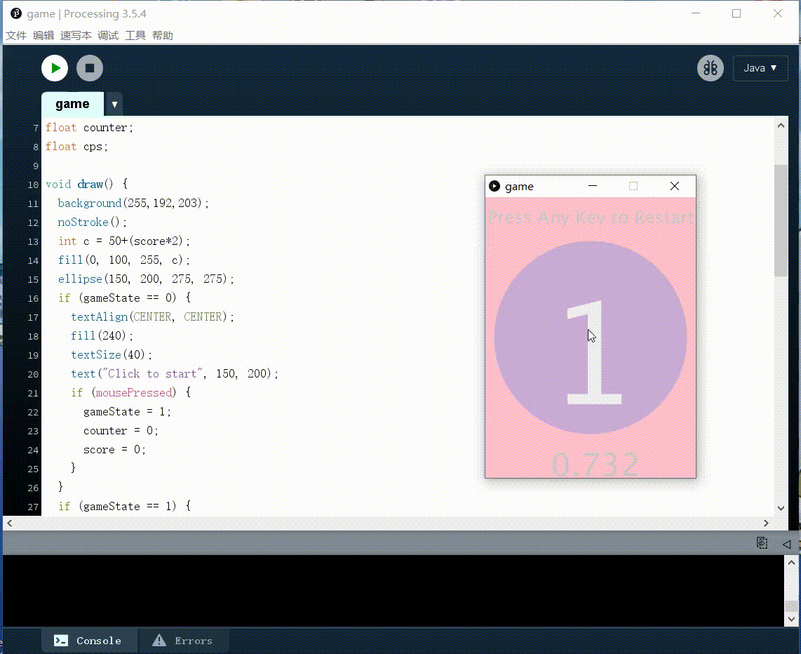
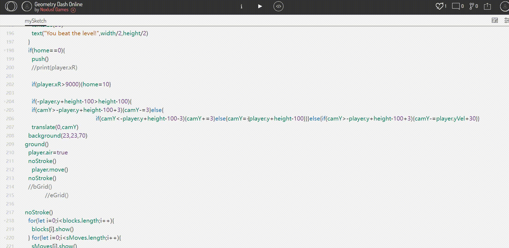
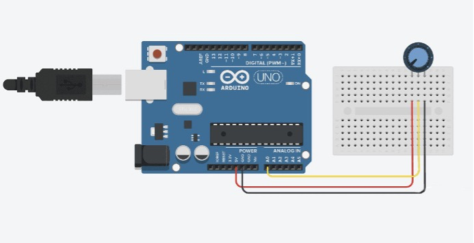

<style>
    .custom-title {
        font-family: "Arial", sans-serif;
        font-size: 2.5em;
        text-align: center;
        padding: 10px 0;
        color: #EFEFEF;
        border-bottom: 3px solid #FF6347;
        margin-bottom: 20px;
    }
</style>

<div class="custom-title">Interface Applicantion Programming</div>

# Introduction to Processing
Processing is a flexible software sketchbook and a language for learning how to code. Since 2001, Processing has promoted software literacy within the visual arts and visual literacy within technology. There are tens of thousands of students, artists, designers, researchers, and hobbyists who use Processing for learning and prototyping.[Processing](https://processing.org/)
## Key Features
**Ease of Use:** Processing was designed to make it straightforward to start with programming for visual creation. It's a great introductory system for those without much prior programming experience.

**Java-based:** The Processing language builds on the Java language, but uses a simplified syntax and graphics programming model.

**IDE:** Processing comes with its own integrated development environment (IDE), which includes a code editor, a console, and a display window to showcase the visual output.

**Community and Libraries:** t has a large community and a wide range of libraries that extend its capabilities for sound, video, hardware interaction, and more.

**Export:**It allows users to export their creations as standalone applications or as Java applets for embedding in web pages (though support for Java applets has largely been dropped in modern web browsers).
## Similar Tools
**[p5.js](https://p5js.org/)**: This is a JavaScript library inspired by Processing. It has similar functions and syntax but is designed for the web, enabling artists and designers to work within the context of the modern web ecosystem.

**[OpenFrameworks](https://openframeworks.cc/)**: An open-source C++ toolkit designed for creative coding, similar to Processing in philosophy but offering a different syntax and set of capabilities. It is more suitable for those who have some experience with C++ or want to create more performance-intensive applications.

**[Cinder](https://libcinder.org/)**: Another C++ library for creative coding, it's aimed at professionals in the field and is used for commercial-grade applications. It provides a powerful, intuitive toolbox for programming graphics, audio, video, networking, image processing, and computational geometry.

**[TouchDesigner](https://derivative.ca/)**: A node-based visual programming language for real-time interactive multimedia content, TouchDesigner is designed for both artists and professionals to create rich interactive experiences.

**[NodeBox](https://www.nodebox.net/)**: For those interested in generative art, NodeBox offers a way to create 2D visuals using a Python-based environment.
# Use Processing to make a simple game
## Game 1 continuous click 
Click on the screen to start timing, in the specified time continuous click on the mouse to indicate the hit, timing can be displayed after the end of the number of consecutive hits, the color of the circle in the middle will deepen with the increase in the number of consecutive hits, the end of the round of timing click on any key to restart the game.
```Processing
void setup() {
  size(300, 400);
}

int gameState = 0;
int score = 0;
float counter;
float cps;

void draw() {
  background(255,192,203);
  noStroke();
  int c = 50+(score*2);
  fill(0, 100, 255, c);
  ellipse(150, 200, 275, 275);
  if (gameState == 0) {
    textAlign(CENTER, CENTER);
    fill(240);
    textSize(40);
    text("Click to start", 150, 200);
    if (mousePressed) {
      gameState = 1;
      counter = 0;
      score = 0;
    }
  }
  if (gameState == 1) {
    counter=counter+0.0183;
    textAlign(CENTER, CENTER);
    fill(240);
    textSize(200);
    text(score, 150, 200);
    textSize(45);
    fill(200);
    text(counter, 150, 375);
    textSize(25);
    text("Press Any Key to Restart", 150, 25);
    if (counter > 10) {
      gameState = 2;
    }
    if (keyPressed) {
      gameState = 0;
    }
  }
  if (gameState == 2) {
    textAlign(CENTER, CENTER);
    fill(240);
    textSize(200);
    text(score, 150, 200);
    textSize(20);
    fill(240);
    text("Clicks Per Second (CPS):", 150, 355);
    textSize(25);
    text("Press Any Key to Restart", 150, 25);
    cps = score/10;
    text(cps, 150, 385);
    if (keyPressed) {
      gameState = 0;
      counter = 0;
      score = 0;
    }
  }
}

void mouseReleased() {
  if (gameState == 1) {
    score++;
  }
}
```

## Game 2 click to jump (complex one)
Run the program to start the game immediately, through the mouse click to make the small square jump up, if not over the obstacles means failure, the game immediately restart; small square over all the obstacles can be victory, the screen will appear "You beat the level!
Levels are built using squares and triangles in coordinates, and you can change the style and color of the levels according to your needs.
[Game 2 code](../_media/pro05_processing/game2.js)

# Arduino and Processing
In this work, we did one demo in Processing and Arduino, which can communicate with each other.
Potentiometer controls the size of circle in Processing. This case is based on the Potentiometer, and the circle in Processing is controlled to change size from small to big through arduino output signal, so as to realize the interaction between software.

In arduino, the Gao Diping signal in human pyroelectric sensor is transmitted through serial port.


```Arduino
int size = 0;
void setup() {
  Serial.begin(9600);
}
void loop(){
  size = map(analogRead(A0),0,1023,5,190);
  Serial.write(size);
//delay(10);
}

```

Import the Serial library in Processing to accept the serial signal transmitted by arduino. Set the screen size and serial port information in setup. Then set the size of the circle according to the signal and draw the circle. In the actual picture, there will be an animation of the circle size changing.

```Processing
import processing.serial.* ;
Serial port;

int diam = 50;

void setup() {
  size(400,400);
  background (#ffffff);
  
  fill(#48CFAD);
  noStroke();
  ellipse(200,200,diam,diam);
   for (int i = 0; i < Serial.list().length; i++) println("[", i, "]:", Serial.list()[i]);
  String portName = Serial.list()[Serial.list().length-1];//check the printed list
  //String portName = Serial.list()[0]; //For windows PC
  port = new Serial(this, portName, 9600);
  port.bufferUntil('\n'); // arduino ends each data packet with a carriage return 
  port.clear();   

}

void draw() {

  while(port.available()>0)
  {
    diam = port.readChar();
    // println(diam);
    clear();
    background (#ffffff);
    ellipse(200,200,diam,diam);
  }
  
    //println(777);
    //delay(100);
}
```
# Try to communicate with Kinect, Leapmotion, or IoT platform.
## Kinect
Microsoft Kinect is the next generation of Computing. 
Kinect is a motion sensing input device by Microsoft for the Xbox 360 video game console and Windows PCs. Based around a webcam-style add-on peripheral for the Xbox 360 console, it enables users to control and interact with the Xbox 360 without the need to touch a game controller, through a natural user interface using gestures and spoken commands. [The project is aimed at broadening the Xbox 360's audience beyond its typical gamer base. Kinect competes with the Wii Remote Plus and PlayStation. Move with PlayStation Eye motion controllers for the Wii and PlayStation 3 home consoles, respectively.
The Kinect for Windows sensor is a fully-tested and supported Kinect experience on Windows with features such as “near mode,” skeletal tracking control, API improvements, and improved USB support across a range of Windows computers and Windows-specific 10’ acoustic models.
The sensor was specifically designed to be used with computers, and includes a shortened USB cable to ensure reliability across a broad range of computers. Kinect for Xbox 360 was built for and tested with the Xbox 360 only, not with any other platform, which is why it is not licensed for general commercial use, supported, or under warranty when used on any other platform.
Kinect for Xbox 360, on the other hand, was built for and tested with the Xbox 360 only, not with any other platform, which is why it is not licensed for general commercial use, supported, or under warranty when used on any other platform.
Microsoft has a large team of engineers that is dedicated to continual improvements of the hardware and software associated with Kinect for Windows, and is committed to providing ongoing access to Microsoft's deep investment in human tracking and speech recognition. But both can be used for development.
[Refernce Website](https://learn.microsoft.com/zh-cn/windows/apps/design/devices/kinect-for-windows)

## Leapmotion
Leap Motion technology makes it possible to interact with technology using your bare hands.The company was founded in 2010 by David Holz and Michael Buckwald, and began shipping the Leap Motion Controller in July 2013.
The Leap Motion Controller works alongside your mouse and keyboard, translating hand and finger movements into a rich array of 3D input. Developers are using the device to create everything from games, art, and music to motion-controlled robots and AR/VR experiences.
[Website](https://developer.leapmotion.com/tracking-software-download)