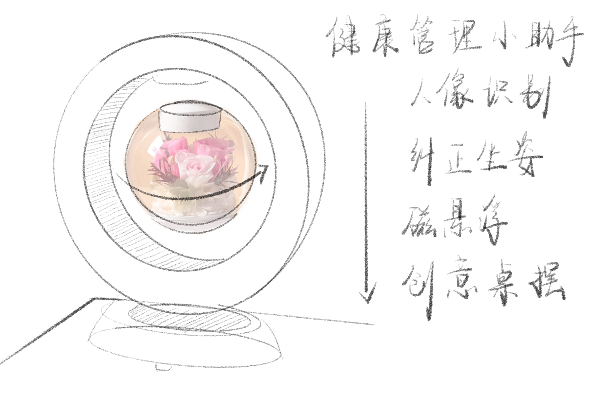

# 06_Final_presentation
现在年轻人，他们在办公桌工作或学习时都或多或少的出现不良坐姿等体态问题，长期这样的话，会引发各种各样的对我们健康有害的体态问题。并且现在部分年轻人工作时容易被琐事分心，且容易陷入情绪困扰。我们将做出一个桌面互动装置，用来提醒使用者不良的坐姿，并使用合理的时间规划提醒帮助他们高效专注，并给予及时的奖励反馈，树立积极的情绪引导，以帮助他们达到健康积极高效的工作状态。
