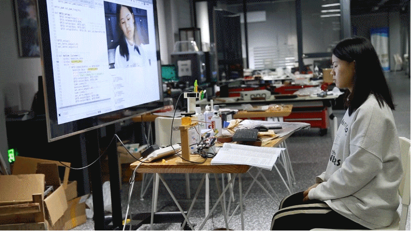

# Project Theme & Background
**POS-REMINDER:** Intelligent desktop interactive device for sitting health

With the development of technology, people's work style tends to sit for a long time and focus on work in a high degree. This may cause various posture problems and health issues. 
To solve these problems, we designed a desktop interactive device to remind users of their bad posture, and use reasonable time planning reminders to help them work efficiently and attentively, and provide timely reward feedback to establish positive emotional guidance, so as to help them achieve a healthy, positive and efficient working status.

# User Research
## I. Introduction

The exact definition of a sedentary lifestyle is when someone spends six or more hours per day sitting or lying down, and they lack significant physical movement in their daily life.

## II. What are some diseases caused by sedentary behavior?

- Vein-related problems 
- Heart disease 
- High cholesterol 
- High blood pressure (hypertension)
- Diabetes

- Obesity 
- Certain types of cancer
- Mental health risks of a sedentary lifestyle
- Stress, anxiety and depression（When physically active, your brain releases serotonin, which is a mood-boosting chemical in your brain. Without physical activity, less serotonin is released, so you may have fewer positive feelings and less motivation.）

## Work habits of young people
Younger generations view the office as a place to not only work with their teams, but also to get their individual work done. Young workers more likely to rank “focus on my work” higher than other generations as top reasons for going into the office.

Two out of three workers would prefer to work from a desk when they’re in the office. Again, we see unique generational differences. Almost half of the Boomer respondents prefer primarily working at the office at a desk not shared by others compared to just 25% of Boomers who prefer primarily working remotely but reserving a desk when they come into the office. Younger generations prefer having flexibility to work remotely over assigned desks at the office. About 70% of Gen Z, Millennials, and Gen X respondents prefer primarily working remotely — but when they come into the office, they prefer either at a reserved desk or an on-demand work setting in common areas. About 30% prefer working in the office at a desk not shared with others.

Data from the newly released 1997 National Health Interview Survey show that 4 in 10 U.S. adults say that they NEVER engage in any exercises, sports, or physically active hobbies in their leisure time. Estimates of sedentary behavior shown here are based on responses to a series of questions asking how often and how long respondents engaged in leisure physical activities for at least 20 minutes that caused sweating or changes in their heart rate or breathing. Sedentary behavior has been identified as a risk factor for a variety of chronic health conditions, including coronary heart disease, hypertension, colon cancer, and diabetes mellitus.

About 40% of U.S. adults were sedentary in 1997, engaging in no leisure time physical activities of any kind. Women (43.2%) were somewhat more likely than men (36.5%) to be sedentary, a finding that held in every age group.

Adults who met the sedentary time threshold were more likely to meet the physical activity recommendation than those who did not. Similarly, adults who met all three sedentary thresholds were more likely to also meet the physical activity recommendation compared with those who did not.

# Market Research Report
## I. Introduction
Today people's work styles are increasingly inclined to sitting for long periods of time. This has led to issues such as poor posture, decreased productivity, and health problems. Especially for young people, when working or studying at their desks, they often suffer from physical discomfort due to maintaining the same posture or using improper sitting habits for long periods of time. Therefore, a desktop interactive device that can remind them to maintain proper posture and improve productivity holds a vast market potential.

**Posture Correction Market:**

**Back Posture Corrector Market:**

## II. Market Demand
### 1.Posture Reminder and Correction Function
According to research on the hazards of prolonged sitting and interventions for improving posture, prolonged poor posture can lead to a range of health issues such as neck pain, lower back discomfort, and wrist pain. Therefore, a desktop interactive device should provide posture reminders and correction features to prevent these problems.

### 2.Effective Time Planning Reminders
Apart from posture issues, many young people also struggle with getting distracted by trivial tasks during work, leading to decreased productivity. According to research on the impact of time management on productivity and strategies for handling it, effective time management can improve productivity and reduce distractions. Therefore, a desktop interactive device should provide timely reminders for time planning to help users manage their time better and increase productivity.

### 3.Positive Emotional Guidance
Emotional distress is a common issue that many young people face during work. According to research on the effects of positive emotions on mental health and strategies for coping, positive emotions can alleviate stress and enhance overall well-being, leading to increased productivity. Therefore, a desktop interactive device should provide positive emotional guidance to help users maintain a positive mindset and improve productivity.

## III. Market Status
Currently, there are some existing products in the market that resemble the described functionality of a desktop interactive device. These products often offer posture reminders and time planning features but may lack attention to users' emotional needs. Additionally, these products have high price, limiting their market penetration.

## IV. Suggested Solutions
### 1.Integration with Existing Products
We can consider combining the desktop interactive device with existing products like smart chairs or smartwatches to achieve additional functionality while reducing costs. For instance, we can integrate posture sensors with smart chairs to accurately monitor and remind users of their posture. Additionally, syncing with smartwatches or mobile apps allows data sharing and remote control.
### 2.Technology Enhancements
Utilizing the latest sensor technology and AI algorithms, we can develop more precise posture detection and reminding capabilities. By incorporating sensors like acceleration sensors, gyroscopes, and pressure sensors, we can monitor users' posture in real-time and provide timely reminders or corrections. Additionally, machine learning algorithms can analyze and learn user behavior patterns to personalize reminders and guidance further.
### 3.Emotion Recognition Technology
Integrating current emotion recognition technologies such as voice recognition or facial expression recognition, we can introduce emotion guidance features. By analyzing users' voices or facial expressions, the device can determine their emotional state and provide appropriate advice or guidance when needed. For instance, when a user is feeling upset or under stress, the device could automatically play calming music or suggest positive coping strategies to alleviate the user's negative emotions.
### 4.Optimized Pricing Strategies
To expand market share and attract more users, we should consider optimizing pricing strategies. For example, by using a modular design and customizable features, we can reduce costs and offer flexible pricing options such as leasing or installment plans. Additionally, providing excellent customer experiences and services can increase user stickiness and referrals, further driving market share growth.
### 5.Ecosystem Development
By partnering with relevant industries like health, education, and entertainment, we can offer comprehensive and personalized solutions to meet diverse user needs and expand our market reach. For instance, collaborating with fitness coaches or medical professionals may allow us to develop customized health management plans and programs that target specific user groups. Partnering with educational institutions could provide learning programs to enhance users' knowledge and skills. Additionally, collaborating with entertainment companies could offer engaging content like games or music to enhance user experience and retention.
### 6.Market Education Initiatives
Introducing market education initiatives can raise public awareness of proper posture and effective work habits. For instance, organizing exhibitions or interactive experiences in public places like offices, schools, or shopping centers can increase visibility and engage users directly. Collaborating with reputable health and productivity experts to present workshops or lectures can also reach new audiences; while social media and content marketing campaigns can spread positive messages further afield. These market education initiatives raise public awareness, leading to increased product recognition and adoption.

# Innovation Points
## I. Existing Solutions

### 1. Blazepose

Blazepose is a body-tracking technology that uses computer vision and machine learning to detect and analyze human pose, shape, and movement in real-time. It allows for accurate measurement of body dimensions, body composition, and posture analysis, providing a comprehensive understanding of a person's physical form and movement. Blazepose can be used for a wide range of applications, including virtual try-on, gaming, animation, health and fitness, sports training, and more.
Example: Design and Implementation of a Detection System for Children's Sitting Posture
To help children reduce health issues such as myopia and spinal curvature caused by poor siting posture, this article designs a real-time siting posture detection and correction system. The system uses the Blazepose bone detection model to obtain the position information of bone key points and calculates depth information of key points based on their coordinates. By setting a threshold to detect siting posture, the system provides real-time voice broadcasting reminders to users who have improper siting posture After testing 8 common improper siting positions, the results showed that the average detection accuracy of the system reached over 95%.

### 2.SVM Algorithm
SVM, which stands for Support Vector Machine, is a machine learning algorithm widely used in pattern recognition, image analysis, text classification, and other fields.
The main idea of SVM is to find a hyperplane that can separate different categories of data points into different sides as much as possible. In other words, SVM is a classification algorithm.
SVM is a type of learning model that separates instances of two classes of objects. The main idea of SVM is to use a separating hyperplane to maximize the distance between the two classes. The hyperplane is defined by a set of support vectors that are closest to the plane. SVM is effective even if the training set is not linearly separable.
SVM has two main types: linear SVM and kernel SVM. Linear SVM uses a linear kernel function to calculate the distance between instances, while kernel SVM uses a non-linear kernel function to calculate the distance. 
Example: Design of Human Sitting Posture Detection System Based on SVM Algorithm
In order to monitor siting posture in time and improve the health status, this paper designs a siting posture detection system by using computer vision metho. Through sampling the existing siting image data set, the image features are obtained by using OpenCV to detect skin color, The image features are classified and labeled to generate data set files. The algorithm of siting position detection in this paper combines SVM and OpenCV cascade detector to realize the function of rea-time siting posture display and voice reminder, which can effectively detect the bad siting posture, and has certain application value.

### 3. FSR Pressure Sensor
FSR pressure sensor is a type of pressure sensor that utilizes Force Sensitive Resistor (FSR) technology. FSR sensors are typically used for measuring pressure or force applied to a specific surface, and they are commonly used in applications such as electronic skins for monitoring human activities or robotics.
FSR sensors consist of a thin, flexible material that is sandwiched between two electrodes. When pressure is applied to the sensor, it changes its resistance value, which can be measured and converted into a readable output signal. The output signal can then be used to determine the amount of pressure applied to the sensor.
Example: Design of Sitting Position Detection System Based on FSR Pressure Sensor
The paper designs a test system for student sitting safety state monitoring. Through the FSR pressure sensor, the pressure signal generated by the bending of the student's collar and spine is collected, and the STM32 single-chip microcomputer is used for effective detection and processing. Finally, the sensor data completed by external treatment is wirelessly sent to the PC, which realizes the collection and real-time display of sensor pressure data in different sitting safety states. The test results show that the designed system can obviously judge the characteristics of poor sitting posture, and can remotely monitor the student's sitting posture.
## Our Work
### tfjs-models-pose-detection
**Why did we choose it?**

Pose detection is a computer vision task that aims to identify the positions of human body joints in images or videos. The tfjs-models-pose-detection is a JavaScript library that can run in the browser or Node.js environment. It is a model in the TensorFlow.js model collection.

This model can be used for real-time pose detection, such as in video conferencing, virtual reality, augmented reality and other applications, or for analyzing motion data, such as in sports training and health monitoring.

Using tfjs-models-pose-detection, developers can easily integrate pose detection functionality into their web applications or Node.js applications. The model is trained to detect multiple joints in the human body, such as the head, shoulders, elbows, wrists, hips, knees, and ankles. It can also handle different human poses and clothing and run well under different image qualities.

### 2. Raspberry Pi 4B

**Why did we choose it?**
Compared to other microcontrollers, the Raspberry Pi 4B has several advantages. Here are some of them:

**1.Powerful processing power:** The Raspberry Pi 4B is equipped with a quad-core ARM Cortex-A72 processor, which provides much more powerful processing capabilities than many other microcontrollers. This allows the Raspberry Pi 4B to handle more complex tasks, such as running high-performance software or even operating as a server.

**2.Easier programming:** The Raspberry Pi 4B is based on Linux, which provides an extensive programming environment and a large community of developers. This makes it easier for developers to find resources and learn how to program the board. In addition, there are many pre-installed programming languages and frameworks available for the Raspberry Pi 4B, such as Python, Java, and Node.js, which further simplifies programming.

**3.Flexible expansion options:** The Raspberry Pi 4B has a rich set of interfaces, such as USB, HDMI, Ethernet, and GPIO, which allow users to connect various peripherals and sensors. This flexibility allows the Raspberry Pi 4B to be used in a wide range of applications, from education to professional development.

**4.Community support:** The Raspberry Pi has a large community of users and developers, which means that you can find help and resources online easily. There are also many tutorials, case studies, and projects available for the Raspberry Pi 4B, making it easier for new users to get started.

In summary, the Raspberry Pi 4B has powerful processing capabilities, easy programming, flexible expansion options, and excellent community support, which make it a versatile and popular microcontroller for various applications.

##	Design & Prototyping Process

1.model slice

2.3D printing

3.laser cutting

4.assembling

5.coding & testing

6.final testing

<iframe width="800" height="350" src="https://www.youtube.com/embed/zYwPO8zztNA?si=RZqcRBMturZ99ctS" align="center" title="YouTube video player" frameborder="0" allow="accelerometer; autoplay; clipboard-write; encrypted-media; gyroscope; picture-in-picture; web-share" allowfullscreen></iframe>

Code is avalible on [Github](https://github.com/NexMaker-Fab/2023zjudemini-hi1/tree/main/md/final_code)

## II. SDGs Analysis on Our Work
### 1. Goal 3: GOOD HEALTH AND WELL-BEING

Maintaining good posture while seated is crucial for maintaining good health. Holding an incorrect sitting posture for prolonged periods can lead to various health issues, including back pain, neck pain, and muscle strain. POS-REMINDER: Intelligent desktop interactive device for sitting health, therefore, plays a crucial role in reminding you to correct your sitting posture and prevent these health issues.The device's ability to remind users of their incorrect sitting posture can also help reduce the stress and fatigue that can be caused by prolonged sitting. By correcting your posture, you can improve your overall comfort and increase your energy levels, leading to better overall well-being.
Additionally, POS-REMINDER can help increase productivity by reducing distractions caused by pain or discomfort. By maintaining a healthy sitting posture, you can focus more effectively on your work and increase your overall efficiency. 

### 2. Goal 7: AFFORDABLE AND CLEAN ENERGY

POS-REMINDER is USB-powered. The device’s USB power source can be connected to almost any computer, which means that the user can take advantage of the power already provided, eliminating the need for any additional power source. This significantly reduces the overall cost of ownership since computers are already a common workplace resource. The device’s low-power consumption also ensures that it won’t drain the computer’s battery, making it an eco-friendly solution.
Since the device runs on USB power, it doesn’t require any batteries or additional power sources, reducing the environmental impact of battery disposal. This makes it an environmentally friendly solution, promoting the use of clean energy without adding any extra burden to the environment.

### 3. Goal 9: INDUSTRY, INNOVATION AND INFRASTRUCTURE

POS-REMINDER can be used in various industries, including the healthcare, technology, and even the manufacturing sectors. It provides a useful tool for employees to maintain good posture while working, reducing the risk of musculoskeletal disorders and improving overall health and well-being. This can lead to increased productivity and efficiency within the workplace.
POS-REMINDER showcases the innovative thinking behind its design. By combining the latest technology to monitor posture with a USB-powered system, it offers a sustainable and eco-friendly solution. The use of innovative technology not only improves our ability to monitor and manage our posture but also highlights the potential for innovation within the field of healthcare and well-being.
Additionally, POS-REMINDER can be considered as an extension of the digital infrastructure that is becoming more prevalent in today's society. Its integration creates a seamless user experience, enabling individuals to benefit from its features without any additional setup or costs.

### 4. Goal 12: RESPONSIBLE CONSUMPTION AND PRODUCTION

POS-REMINDER aligns with the principles of responsible consumption and production. It encourages users to adopt healthier posture habits, reducing the potential for health issues while seated. Additionally, the device’s eco-friendly design promotes sustainable production methods that prioritize environmental protection and resource efficiency. Through its integration with responsible consumption and production practices, the device plays a role in promoting a healthier and more sustainable lifestyle.