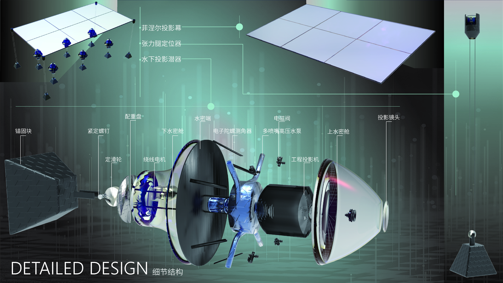

  

<h1 align="center">李庆龄</h1>

  大家好我是李庆龄，enfj大剑人一枚，平时也喜欢玩玩音乐，也想多和大家做朋友，其余没啥好说的，给大家拜个早年！

  ## Field
Interaction Design, User Experience Design， Product Design.

## Skills
- Modeling with software such as Alias, Rhino, C4D, etc.
- Programming utilizing Processing, C, Python, etc.
- Use of design software such as UE4, Arduino, TouchDesigner, etc.
- Proficiency in FL studio arranging software

## Education
### Ocean University of China
- **Degree**: Bachelor of Engineering
- **Competitions**: Three national first prizes for the design of ocean-going vessels
- **Activities**: Performers of the Ocean University of China Art Troupe

### School Name
- 2019.9-2023.6 Ocean University of China
- 2023.9- Zhejiang University

## Experiences
### Social Practice
- **Role**: Vice President of Ocean University of China Qihang Innovation Association
- **Achievements**: Organize TEDxOUC speaking events
- **Role**: Minister of Activities, Red Cross Branch, Ocean University of China
- **Achievements**: Organization of the Qingdao Blood Donation Campaign
- **Role**: Members of Ocean University of China Art Troupe
- **Achievements**: Participated in more than ten performances on and off campus

## Honor
- Honor or award 1：National silver prize for the Challenge Cup.
- Honor or award 2：Four national first prizes for the design of ocean-going vessels.
- Honor or award 3：Second Prize of Shandong Province Industrial Design Competition
- Honor or award 4：Outstanding Individual Award, College of Engineering, Ocean University of China

## Works
- **Project Name**: Underwater glider based on jellyfish morphology simulation

- **Project Name**: Sound Visualization Design

- **Project Name**: Underwater projection equipment

- **Project Name**: Interactive equipment for autistic children

